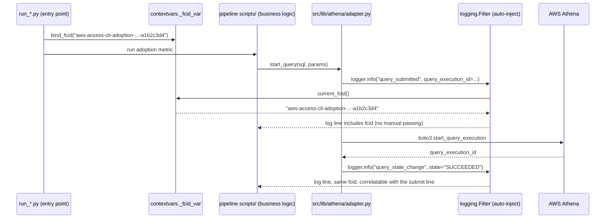
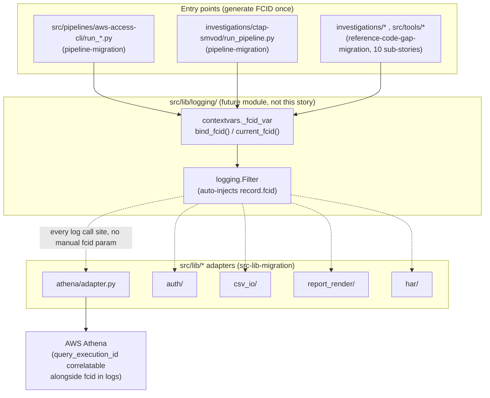

# Flow-correlation-id logging — story specs

> One task per session. Find the first unchecked item in `tasks.md`. That is your only task. Full implementation rules live in `AGENTS.md` + `PYTHON_DESIGN.md`. After each task: set `SHA:` on the task
> line + tick the box, update the story status summary, add one line to your backlog/session-log file.

---

## FCID-1 — Define the FCID convention

**Files to change / create:**
- This file (`stories.md`) — the convention spec below, already written as this task's output.

**What to implement (design decisions, not code):**

1. **Name:** FCID (Flow Correlation ID). One FCID per *run* — one invocation of a pipeline (`run_pipeline.py`), one investigation script execution, one tool CLI invocation, one ad hoc `scripts/`
   script run. Not one per Athena query, not one per log line — queries and log lines are children of a run, identified by FCID plus their own sub-ids (e.g. `query_execution_id`).
2. **Format:** `fcid = f"{entry_point_slug}-{utc_timestamp:%Y%m%dT%H%M%S}-{uuid4().hex[:8]}"` — e.g. `aws-access-cli-adoption-20261001T220500-a1b2c3d4`. Rationale: a bare UUID is not
   greppable/human-sortable; prefixing the entry-point slug + timestamp makes `grep fcid=aws-access-cli-adoption logs/*.log` and chronological log-file scanning both work without parsing JSON first.
   The trailing random suffix keeps it unique under same-second re-invocation (e.g. a retried cron job).
3. **Generation point:** exactly once, at the **outermost entry point** of each consumer — the `if __name__ == "__main__":` block of a pipeline's `run_*.py`, a tool's CLI `main()`, or an investigation
   script's top-level call. Never regenerated by any `src/lib/*` adapter or downstream function — if an FCID reaches an adapter, the adapter uses it, it does not mint a new one.
4. **Propagation mechanism:** a module-level `contextvars.ContextVar[str]` in `src/lib/logging/context.py` (future implementation, not this story):
   ```python
   _fcid_var: ContextVar[str | None] = ContextVar("fcid", default=None)
   def bind_fcid(fcid: str) -> None: _fcid_var.set(fcid)
   def current_fcid() -> str | None: return _fcid_var.get()
   ```
Chosen over explicit parameter-threading because `src/lib/*` adapters (per `athena-lib-integration` ALI-2) are already constructor-injected and delegation-only — adding an `fcid: str` parameter to
every adapter method would violate that story's own "one-line-to-few-line delegation" shape and leak a cross-cutting concern into every method signature across six modules. `contextvars` is stdlib,
thread-safe, and (with `copy_context()`) safe across `concurrent.futures`/`asyncio` boundaries — relevant once Athena batch submission (flagged in the 2026-10-01 review) runs queries concurrently
under one FCID.
5. **Log-line shape:** every log record gets `fcid` injected automatically via a `logging.Filter` (not a manual kwarg at each call site) — the filter reads `current_fcid()` and sets `record.fcid =
   value or "no-fcid"`. The project's shared `setup_logging()` formatter includes `%(fcid)s` in every handler's format string (or the `fcid` field in the structured/JSON formatter). Example structured
   line:
   ```json
   {"ts": "2026-10-01T22:05:12Z", "level": "INFO", "fcid": "aws-access-cli-adoption-20261001T220500-a1b2c3d4",
    "logger": "src.lib.athena.adapter", "query_execution_id": "q-9f8e...", "tenant": "mtn-za",
    "sql_fingerprint": "7c3a1e2b", "event": "query_state_change", "state": "SUCCEEDED", "duration_ms": 4210}
   ```
6. **Who sets it at each consumer type:**
   - Pipeline (`src/pipelines/aws-access-cli/run_*.py`) — generate once per cron-triggered process start.
   - Investigation (`investigations/ctap-smvod/run_pipeline.py`) — generate once per manual invocation of the 6-step orchestrator; all 6 steps share it.
   - Tool (`src/tools/*`) — generate once per CLI invocation.
   - Ad hoc `scripts/` one-offs — same rule, no exception; a one-off script is still a "run."

**Open question flagged, not resolved here** (per `prompt.md`'s "Perspectives not covered"): cross-process propagation — if a pipeline step shells out to a subprocess or triggers a separate cron
entry, the FCID does not cross that boundary automatically under this design (`contextvars` is in-process only). A future session must decide whether to pass it via an env var (`IHTL_FCID`) for
subprocess children, once a real multi-process pipeline step needs it.

**Tests:** N/A — design-only task, no code.

**Commit:** `docs(fcid): define flow-correlation-id logging convention`

---

## FCID-2 — Reference diagrams + coordination notes

**Files to change / create:**
- This file (`stories.md`) — the two diagrams below.
- `../src-lib-migration/README.md` — one coordination-note line.
- `../pipeline-migration/README.md` — one coordination-note line.
- `../reference-code-gap-migration/README.md` — one coordination-note line.

**What to implement:**

1. Add the sequence diagram and component diagram below (already written as this task's output).
2. Append one dated line to each of the three epics' "Supersession / coordination" section, in the same style as `reference-code-gap-migration`'s existing `mpd`/ `crypto_signing` coordination notes —
   i.e. "this epic does not implement X itself; this is the coordination record for whoever picks up Y next."

**Sequence diagram — one Athena query inside one pipeline run:**



**Component diagram — FCID flowing through `src/lib/*` into all three epics' consumers:**



**Tests:** N/A — design-only task, no code.

**Commit:** `docs(fcid): add reference diagrams + coordination notes to 3 epics`
