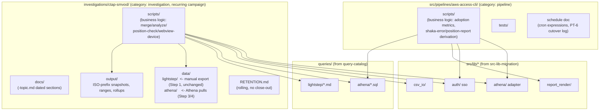

# Pipeline migration — epic index

> Port the two real, running `github_copilot` projects with substantial business logic — `aws-access-cli` (scheduled Athena adoption/session/shaka-error reports, cron-driven) and
> `ctap-smvod-session-report` (a recurring, part-manual/part-Athena investigation campaign) — into `ih-trace-lab`'s `project-taxonomy` target layout, splitting each project's code into `src/lib/*`
> (domain-mechanism, consumed via `src-lib-migration`) vs. project-local `scripts/` (business logic, stays put), replacing every ad hoc SQL string with `query-catalog`'s catalog, and replacing the
> current flat, date-suffixed output directories with `project-taxonomy` PT-7's config-driven path resolver and ISO-prefix filename convention. One epic because both stories share the same three
> blocking dependencies and the same lib-vs-script boundary test; two stories because the two projects land in different `project-taxonomy` categories with different folder skeletons and different
> migration mechanics (a pipeline's cron-cutover vs. an investigation campaign's manual-step handling).

## Why this epic exists

Auditing `/Users/abhadra/github_copilot/aws-access-cli` (~7,566 lines across `scripts/`) and `/Users/abhadra/github_copilot/ctap-smvod-session-report` (~5,198 lines across `scripts/` + 45 files under
`queries/`) while scoping `src-lib-migration` found neither project's actual business logic — only their generic Athena-executor/CSV-writer/auth duplication — named in any existing plan.
`functional-code-taxonomy`, `query-catalog`, and `src-lib-migration` all cite these two projects solely as *audit sources* ("here is where the duplicated pattern lives"), never as "port this
pipeline's report-generation logic." That logic is real, substantial, and currently un-migrated:

- `aws-access-cli`: `athena_runner/adoption/` (11 metric definitions + a registry + a report store), `athena_runner/queries/` (6 SQL query classes), `athena_runner/shaka_errors/` and
  `athena_runner/position_report/` (report-specific derivation logic), 15 `run_*.py` entry-point scripts, and 3 live system-crontab entries (daily/weekly/monthly) with no git-tracked record.
- `ctap-smvod-session-report`: a 6-step `run_pipeline.py` orchestrator (Step 1 — manually exporting 3 Lightstep CSVs — is explicitly *not* automatable, see its own docstring), 8
  `analyze_*.py`/`build_*.py`/`extract_*.py`/`merge_*.py` business-logic scripts, and 45 files under `queries/` — plus a flat `output/<report>_<DDMMYYYY>.csv` directory (29 files as of the 2026-09-30
  audit, no date-range/rollup distinction, no source/tool-provenance split for its `inputCSV/` inputs) that is exactly the inefficiency `project-taxonomy` PT-7 was designed to fix.

This epic is the follow-up that actually ports both, once its three blocking dependencies land.

## Scope decisions

- **Blocked on three sibling stories landing first**, confirmed with the epic requester, 2026-09-30:
  - `docs/plan/project-taxonomy/` PT-1, PT-2, PT-7 (category definitions, folder skeletons, `config/data_paths.yaml` + ISO-prefix filename convention) — both stories' target layout comes from there,
    not invented here. `aws-access-cli-pipeline-migration` additionally needs PT-6 (cron-cutover procedure) before its cron step.
  - `docs/plan/src-lib-migration/` — both stories consume `src/lib/{athena,auth,csv_io,report_render}` once those stories land; neither re-implements the executor/writer/auth logic those stories
    already own.
  - `docs/plan/query-catalog/` — both stories hand their SQL text (`aws-access-cli`'s 6 query classes, `ctap-smvod`'s 45 query files) to that story's `queries/athena/`/`queries/lightstep/` catalog;
    this epic does not invent a second SQL-ownership location.
- **Category assignment is fixed by `project-taxonomy/structure.md`'s own worked examples**, not re-decided here: `aws-access-cli` → **pipeline** (`src/pipelines/aws-access-cli/`);
  `ctap-smvod-session-report` → **investigation, recurring campaign** (`investigations/ctap-smvod/`, Rule B).
- **Lib-vs-script split test (answers the epic requester's direct question):** apply `functional-code-taxonomy` FCT-1's existing "shared vs. specific" test verbatim — logic operating on a domain
  mechanism (starting/polling/downloading an Athena query, writing a CSV, refreshing an SSO session) is a `src/lib/*` consumer, not a re-implementation; logic encoding a specific business rule (which
  columns an adoption metric selects, how a shaka-error position is derived, how CTAP/SM-VOD/debug-event rows get merged and joined) stays local to the project's own `scripts/`, however large.
  Concretely: `athena_runner/adoption/metrics/*.py`, `athena_runner/shaka_errors/*.py`, `athena_runner/position_report/derive.py`, and every `ctap-smvod` `analyze_*
  .py`/`build_*.py`/`merge_*.py`/`extract_*.py` stay in that project's `scripts/` — they are business rules, not domain mechanisms — even though they are the bulk of both projects' line count.
- **Output reorganization uses PT-7's design as-is** — root `data/` (raw pulls, `.gitignore`d) split by source/tool provenance (`lightstep/`, `athena/`) for `ctap-smvod`'s recurring per-date data,
  `investigations/ctap-smvod/output/` for post-merge deliverables, ISO-prefix filenames (`<date>_<artifact>.csv`, ranges `<start>_<end>_<artifact>.csv` tag-trailing, rollups with a
  `_rollup`/`_all_dates` marker instead of a date) — this directly replaces the current flat `output/setupsession_with_outcome_28072026.csv`-style naming the epic requester flagged as inefficient.
  Neither story invents a new filename scheme; both cite PT-7's task spec by id.
- **`ctap-smvod`'s Step 1 (manual Lightstep CSV export) stays manual** — this epic does not attempt to automate a step the source project's own docstring already states has no live API; it only
  relocates where the manually-exported files land (`investigations/ctap-smvod/data/lightstep/`, ISO-prefixed) and updates the pipeline's file-not-found guidance accordingly.
- **No file under `/Users/abhadra/github_copilot` is ever created, edited, or deleted** by either story — read-only reference throughout.

## Architecture — target layout for both projects

## Stories

| Story | Purpose | Status | Depends on | Closing SHA |
|---|---|---|---|---|
| `aws-access-cli-pipeline-migration/` | Port Athena reports to `src/pipelines/aws-access-cli/`, incl. PT-6 cutover | ⬜ Not started | taxonomy PT-1/2/6/7, lib-migration, catalog | — |
| `ctap-smvod-investigation-migration/` | Port campaign to `investigations/ctap-smvod/`, incl. manual-step + output reorg | ⬜ Not started | taxonomy PT-1/2/7, lib-migration, catalog | — |

Status: ⬜ Not started · 🔄 In progress · ✅ Done. This column is the epic's progress view — per-task checkboxes live only in each sub-story's `tasks.md`.

## Cross-cutting constraints

- Every task that moves a file states the lib-vs-script test result for that specific file, not just a blanket category assignment — a reviewer must be able to check each move against the test, not
  just trust the summary.
- Neither story touches `queries/index.md`'s ownership rules or `config/data_paths.yaml`'s template definitions — both are consumed as-is from `query-catalog`/`project-taxonomy` PT-7, not re-specified
  here.
- No live AWS/Athena/Lightstep calls in either story's tests — mocked collaborators only, matching `src-lib-migration`'s own test convention.
- Every output-path change cites the specific PT-7 filename-convention clause it follows (snapshot / range / rollup) — no ad hoc filename invented outside that convention.

## Supersession / coordination

- `functional-code-taxonomy` FCT-1's audit-citation list and `query-catalog`'s own file inventory should, once picked up, cross-reference this epic's stories as the actual consumers/movers of the
  files they cite — this epic does not edit those stories' files itself (both are not yet started); this note is the coordination record.
- `aws-access-cli-pipeline-migration`'s cron-cutover step is the first real exercise of `project-taxonomy` PT-6's procedure — if that procedure proves incomplete in practice, the fix belongs in PT-6's
  own spec, not a silent workaround here.
- **2026-10-01:** `docs/plan/flow-correlation-id-logging/` defines the project's FCID (flow-correlation-id) logging convention. Both stories here generate one FCID per run at their entry point
  (`run_*.py` for `aws-access-cli`, `run_pipeline.py` for `ctap-smvod`) and rely on `src/lib/*` adapters to auto-inject it into every log line — neither story implements the convention itself; this is
  the coordination record.

## Epic done when

- **aws-access-cli-pipeline-migration** — `src/pipelines/aws-access-cli/` exists with all 11 adoption metrics + shaka-error + position-report logic intact and passing tests, importing `src/lib/*` for
  every domain-mechanism concern; its 6 SQL query classes are cataloged in `query-catalog`; its 3 crontab entries have completed PT-6's cutover procedure with a logged removal of the old entries; no
  ad hoc flat output filenames remain.
- **ctap-smvod-investigation-migration** — `investigations/ctap-smvod/` exists with `run_pipeline.py` and every analyze/build/merge/extract script intact and passing tests, importing `src/lib/*`; Step
  1's manual Lightstep export now lands in `data/lightstep/`; Athena pulls land in `data/athena/`; all outputs use PT-7's ISO-prefix convention; its 45 query files are cataloged in `query-catalog`;
  `RETENTION.md` states its rolling, no-close-out status.
- No file under `/Users/abhadra/github_copilot` was created, edited, or deleted by any story in this epic.
