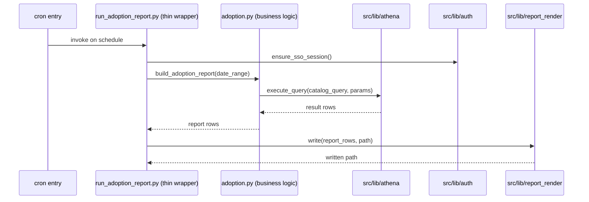
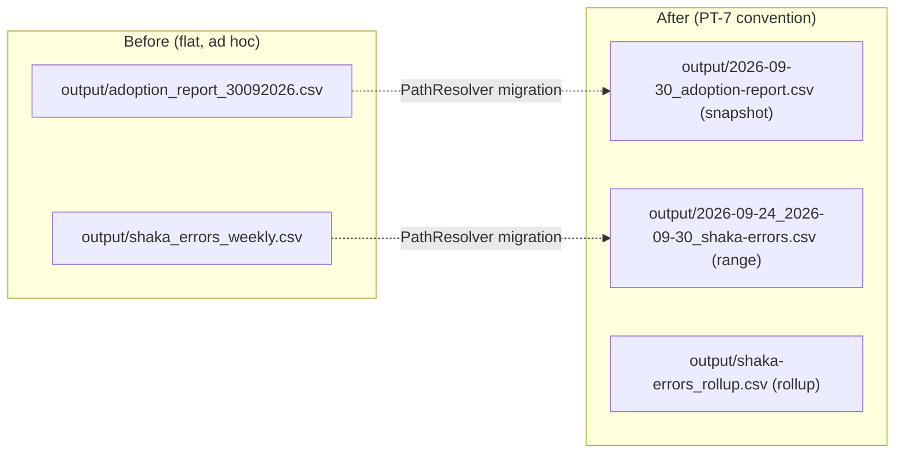

# aws-access-cli pipeline migration — story specs

> One task per session. Find the first unchecked item in `tasks.md`. That is your only task. Full implementation rules live in `PYTHON_DESIGN.md` and this project's own standards docs. After each
> task: set `SHA:` on the task line + tick the box, update the story status summary, add one line to your backlog/session-log file.

---

## AAM-1 — Audit + lib-vs-script classification table

**Files to change / create:**
- `docs/plan/pipeline-migration/aws-access-cli-pipeline-migration/audit.md` — the classification table.

**What to implement:**

1. Walk `/Users/abhadra/github_copilot/aws-access-cli/scripts/` (read-only) and list every `.py` file with its line count.
2. For each file, apply `functional-code-taxonomy` FCT-1's shared-vs-specific test and record the verdict: **lib** (domain-mechanism — Athena execution, SSO auth, generic CSV/report writing) or
   **script** (business logic — specific to adoption/shaka/position reporting). Known verdicts to confirm, not assume: `athena_runner/config.py`, `athena_runner/aws_clients.py`,
   `athena_runner/query_executor.py`, `athena_runner/result_downloader.py`, `athena_runner/sso_auth.py` → **lib** (superseded by `athena-lib-integration`/`auth-lib-migration`, not re-ported);
   `athena_runner/adoption/**`, `athena_runner/shaka_errors/**`, `athena_runner/position_report/**`, all `run_*.py` → **script** (business logic, ported here).
3. For every **script**-classified file, note which `src/lib/*` module(s) it will need to import once ported (e.g. "imports `src/lib/athena` for query execution").
4. Note the 3 live crontab entries verbatim (schedule + command) as reported by the project's own docs/scripts — this becomes PT-6 cutover input for AAM-5.

**Tests:** none — this is a documentation/audit task, no code changes.

**Commit:** `docs(pipeline-migration): audit aws-access-cli lib-vs-script split`

---

## AAM-2 — `src/pipelines/aws-access-cli/` skeleton + thin wrappers

**Files to change / create:**
- `src/pipelines/aws-access-cli/__init__.py`
- `src/pipelines/aws-access-cli/scripts/*.py` — one thin wrapper per `run_*.py` entry point, plus one business-logic module per report family (`adoption.py`, `shaka_errors.py`, `position_report.py`),
  ported from the AAM-1 audit's **script**-classified files.
- `src/pipelines/aws-access-cli/tests/` — test scaffold (filled by AAM-6, created here).

**What to implement:**

1. Create the skeleton exactly matching `project-taxonomy/structure.md`'s `src/pipelines/<pipeline-slug>/` layout.
2. Port each business-logic module verbatim in behavior, replacing its local `athena_runner.query_executor`/`aws_clients`/`sso_auth` calls with the equivalent `src/lib/{athena,auth}` adapter calls
   (per `athena-lib-integration`/`auth-lib-migration`'s documented import surface) — do not re-derive a new interface here.
3. Rewrite each `run_*.py` as a thin wrapper: argument parsing + calling the business-logic module + calling `src/lib/report_render` for output formatting. No business logic in the wrapper.

**Tests:** deferred to AAM-6 (scaffold only here, per the split already decided in `src-lib-migration`'s own stories).

**Commit:** `feat(pipeline-migration): create aws-access-cli pipeline skeleton + thin wrappers`

---

## AAM-3 — SQL extraction to query-catalog

**Files to change / create:**
- `src/pipelines/aws-access-cli/scripts/*.py` — remove inline SQL, call the catalog instead.
- (files under `query-catalog`'s own catalog directory — path and format owned by that story, not redefined here.)

**What to implement:**

1. For each of the 6 `athena_runner/queries/*.py` classes, extract its SQL text into `query-catalog`'s catalog following that story's own file-per-query convention (do not invent a new one).
2. Replace the pipeline's query-class instantiation with a catalog lookup + parameter binding call.
3. Confirm no `.py` file under `src/pipelines/aws-access-cli/` contains an inline multi-line SQL string after this task.

**Tests:**
- `test_query_lookup_returns_catalog_entry` — the pipeline resolves each of the 6 queries by catalog key.
- `test_no_inline_sql_remains` — a simple grep-based regression test scanning the pipeline's source tree for `SELECT`/`FROM` string literals.

**Commit:** `refactor(pipeline-migration): move aws-access-cli SQL to query-catalog`

---

## AAM-4 — Output-path migration to PT-7 convention

**Files to change / create:**
- `src/pipelines/aws-access-cli/scripts/*.py` — replace ad hoc output paths with `PathResolver` calls.
- `config/data_paths.yaml` — add/confirm the templates this pipeline needs (owned by PT-7; only add entries here, don't redesign the schema).

**What to implement:**

1. For each report writer, determine whether its output is a **snapshot** (single date), **range** (date span), or **rollup** (cumulative/all-dates) per PT-7's own clause definitions.
2. Replace the hardcoded `output/` path-building with a `PathResolver` call using the matching `config/data_paths.yaml` template (`data_with_campaign`/`data_without_campaign` as applicable — this
   pipeline has no campaign concept, so the campaign-less template applies throughout).
3. Verify no two-argument date-suffix filenames (`_DDMMYYYY`) remain anywhere in the pipeline's output code.

**Tests:**
- `test_snapshot_filename_is_iso_prefixed` — a single-date report resolves to `<date>_<artifact>.csv`.
- `test_range_filename_tags_trailing` — a date-range report resolves to `<start>_<end>_<artifact>.csv`.
- `test_rollup_filename_has_marker` — a cumulative report resolves to a `_rollup`/`_all_dates`-marked filename, no date.

**Commit:** `refactor(pipeline-migration): migrate aws-access-cli output paths to PT-7 convention`

---

## AAM-5 — Cron-cutover for the 3 live crontab entries

**Files to change / create:**
- `docs/plan/pipeline-migration/aws-access-cli-pipeline-migration/cutover-log.md` — the PT-6-required parallel-run/diff record.

**What to implement:**

1. Follow PT-6's cutover procedure verbatim: install the new `src/pipelines/aws-access-cli/` entry points as additional crontab entries running **alongside** (not replacing) the existing
   `aws-access-cli` entries, for the required number of consecutive scheduled runs.
2. Diff each parallel run's output against the legacy run's output (accounting for the PT-7 filename change — compare row content, not filename).
3. Once the required number of consecutive matches is reached, remove the old crontab entries and log the removal (date, entries removed, match count achieved) in `cutover-log.md`.

**Tests:** none automatable — this is a live-environment operational task; the diff results themselves are the verification artifact, recorded in `cutover-log.md`.

**Commit:** `chore(pipeline-migration): complete aws-access-cli cron cutover`

---

## AAM-6 — Tests for ported business-logic modules + CONTEXT.md pointer

**Files to change / create:**
- `src/pipelines/aws-access-cli/tests/test_adoption.py`
- `src/pipelines/aws-access-cli/tests/test_shaka_errors.py`
- `src/pipelines/aws-access-cli/tests/test_position_report.py`
- `CONTEXT.md` — one "What Exists" pointer line.

**What to implement:**

1. Write a happy-path + edge-case test for each business-logic module, mocking `src/lib/athena`'s query-execution collaborator — no live AWS/Athena calls.
2. Add the `CONTEXT.md` pointer line for `docs/plan/pipeline-migration/aws-access-cli-pipeline-migration/`, matching the style of the existing `src-lib-migration` line.

**Tests:**
- `test_adoption_metric_happy_path` — a known input produces the expected metric row.
- `test_adoption_metric_missing_data_edge_case` — missing/empty Athena result is handled without a crash.
- (equivalent pairs for `shaka_errors` and `position_report`.)

**Commit:** `test(pipeline-migration): add aws-access-cli business-logic tests`
