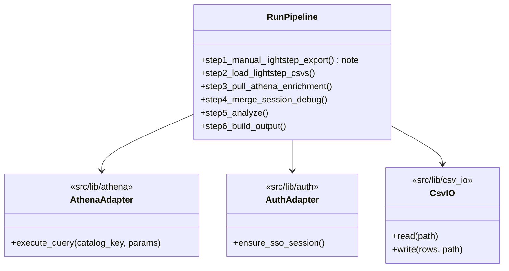
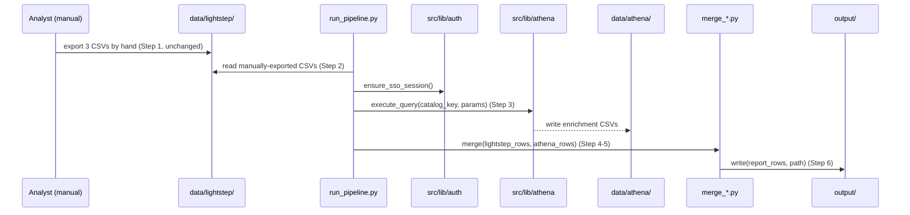
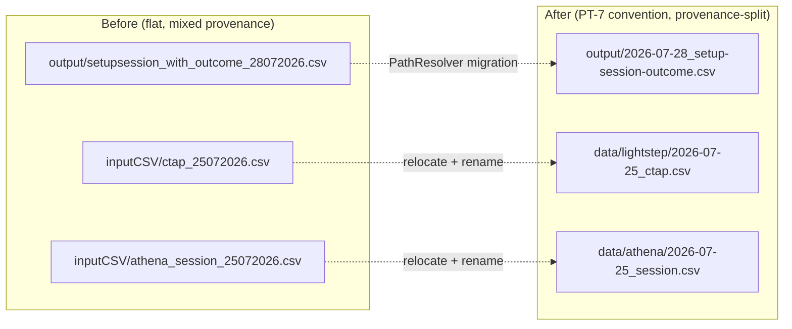

# ctap-smvod investigation migration — story specs

> One task per session. Find the first unchecked item in `tasks.md`. That is your only task. Full implementation rules live in `PYTHON_DESIGN.md` and this project's own standards docs. After each
> task: set `SHA:` on the task line + tick the box, update the story status summary, add one line to your backlog/session-log file.

---

## CSM-1 — Audit + lib-vs-script classification table

**Files to change / create:**
- `docs/plan/pipeline-migration/ctap-smvod-investigation-migration/audit.md` — the classification table.

**What to implement:**

1. Walk `/Users/abhadra/github_copilot/ctap-smvod-session-report/scripts/` (read-only) and list every `.py` file with its line count, including `scripts/lib/*.py`.
2. Apply the FCT-1 shared-vs-specific test to each: `scripts/lib/athena_runner.py`, `scripts/lib/aws_sso.py` → **lib** (superseded by `athena-lib-integration`/`auth-lib-migration`, not re-ported);
   `scripts/lib/debug_event_parser.py`, `run_pipeline.py`, every `analyze_*.py`/`build_*.py`/`extract_*.py`/`merge_*.py`, `correlate_cdn_ips.py`, `flatten_debug_events.py`, `process_traces.py`,
   `lightstep_ctap_smvod_join.py` → **script** (business logic, ported here).
3. For each **script**-classified file, note which `src/lib/*` module(s) it needs (e.g. `merge_*.py` needs `src/lib/csv_io`).
4. Separately list `queries/` (45 files) — these are handed to CSM-6, not classified lib/script (they are SQL text, owned by `query-catalog`).

**Tests:** none — documentation/audit task, no code changes.

**Commit:** `docs(pipeline-migration): audit ctap-smvod lib-vs-script split`

---

## CSM-2 — `investigations/ctap-smvod/` skeleton + business-logic ports

**Files to change / create:**
- `investigations/ctap-smvod/scripts/*.py` — ported business-logic scripts from the CSM-1 audit.
- `investigations/ctap-smvod/docs/` — dated-section docs folder per `project-taxonomy` convention.
- `investigations/ctap-smvod/tests/` — test scaffold (filled by CSM-7, created here).

**What to implement:**

1. Create the skeleton exactly matching `project-taxonomy/structure.md`'s Rule B (`investigations/<campaign-slug>/`, recurring campaign) layout.
2. Port each business-logic script verbatim in behavior, replacing `scripts/lib/athena_runner.py`/`aws_sso.py` calls with `src/lib/{athena,auth}` adapter calls, and any local CSV read/write with
   `src/lib/csv_io`.
3. Port `run_pipeline.py` as the orchestrator, preserving its 6-step structure and explicit Step 1 manual-only note (do not silently drop that documentation).

**Tests:** deferred to CSM-7 (scaffold only here).

**Commit:** `feat(pipeline-migration): create ctap-smvod investigation skeleton + business-logic ports`

---

## CSM-3 — Manual Lightstep step relocation

**Files to change / create:**
- `investigations/ctap-smvod/scripts/run_pipeline.py` — update Step 1/2 file-path guidance.
- `investigations/ctap-smvod/data/lightstep/` — destination directory (create with a `.gitkeep` or README noting it's `.gitignore`d raw data).

**What to implement:**

1. Update `run_pipeline.py`'s Step 1 docstring/guidance and Step 2's file-lookup path to point at `data/lightstep/`, ISO-prefixed filenames (e.g. `2026-09-30_ctap.csv`, `2026-09-30_smvod.csv`,
   `2026-09-30_smvod-ts.csv`) instead of the old `inputCSV/ctap_DDMMYYYY.csv`-style naming.
2. Do not add any code that fetches Lightstep data automatically — Step 1 remains a manual human action; only the destination path and filename convention change.
3. Add a short README note in `data/lightstep/` restating that these files are manually exported and listing the exact filename pattern expected.

**Tests:**
- `test_step2_reads_iso_prefixed_lightstep_files` — given files under `data/lightstep/` in the new naming, Step 2 loads them correctly.
- `test_step2_missing_file_error_message_names_new_path` — a missing file produces a guidance message pointing at `data/lightstep/`, not the old `inputCSV/` path.

**Commit:** `refactor(pipeline-migration): relocate ctap-smvod manual Lightstep exports to data/lightstep`

---

## CSM-4 — Athena-pull relocation

**Files to change / create:**
- `investigations/ctap-smvod/scripts/*.py` — replace `scripts/lib/athena_runner.py` calls with `src/lib/athena`.
- `investigations/ctap-smvod/data/athena/` — destination directory.

**What to implement:**

1. Replace every Athena-pull step's local executor call with `src/lib/athena`'s adapter (per `athena-lib-integration`'s documented import surface).
2. Write pulled enrichment CSVs to `data/athena/`, ISO-prefixed, replacing the old `inputCSV/athena_session_*`/`debug_states_*` naming.

**Tests:**
- `test_athena_pull_writes_iso_prefixed_file` — a pull step writes to `data/athena/<date>_<artifact>.csv`.
- `test_athena_pull_uses_lib_adapter` — the pull step calls the `src/lib/athena` adapter, not a local executor (mock-based assertion).

**Commit:** `refactor(pipeline-migration): migrate ctap-smvod Athena pulls to src/lib/athena + data/athena`

---

## CSM-5 — Output reorg to PT-7 convention

**Files to change / create:**
- `investigations/ctap-smvod/scripts/*.py` — every output-writing step.

**What to implement:**

1. Classify each output artifact as snapshot / range / rollup per PT-7's clause definitions (most `ctap-smvod` outputs are per-date snapshots; confirm any cumulative/all-dates report is marked as
   rollup, not date-suffixed).
2. Replace hardcoded `output/` path-building with `PathResolver` using PT-7's `investigation_output` template.
3. Verify no `_DDMMYYYY`-style filename remains anywhere in `investigations/ctap-smvod/`.

**Tests:**
- `test_snapshot_output_is_iso_prefixed` — a per-date report resolves to `<date>_<artifact>.csv`.
- `test_rollup_output_has_marker` — any cumulative report resolves to a `_rollup`-marked filename.

**Commit:** `refactor(pipeline-migration): migrate ctap-smvod output paths to PT-7 convention`

---

## CSM-6 — SQL extraction to query-catalog

**Files to change / create:**
- `investigations/ctap-smvod/scripts/*.py` — remove inline query text, call the catalog instead.
- (files under `query-catalog`'s own catalog directory — path/format owned by that story.)

**What to implement:**

1. Move all 45 files under `queries/` into `query-catalog`'s catalog following that story's file-per-query convention.
2. Replace each pipeline step's query-loading code with a catalog lookup + parameter binding call.
3. Confirm zero inline SQL/query-string literals remain under `investigations/ctap-smvod/`.

**Tests:**
- `test_query_lookup_returns_catalog_entry` — each of the migrated queries resolves by catalog key.
- `test_no_inline_sql_remains` — grep-based regression test over the investigation's source tree.

**Commit:** `refactor(pipeline-migration): move ctap-smvod queries to query-catalog`

---

## CSM-7 — Tests + RETENTION.md + CONTEXT.md pointer

**Files to change / create:**
- `investigations/ctap-smvod/tests/test_*.py` — one per ported business-logic script.
- `investigations/ctap-smvod/RETENTION.md`
- `CONTEXT.md` — one "What Exists" pointer line.

**What to implement:**

1. Write a happy-path + edge-case test for each ported business-logic script, mocking `src/lib/{athena,csv_io}` collaborators — no live Athena/Lightstep calls.
2. Write `RETENTION.md` stating this investigation is a rolling, recurring campaign with no close-out date, per Rule B.
3. Add the `CONTEXT.md` pointer line for `docs/plan/pipeline-migration/ctap-smvod-investigation-migration/`.

**Tests:**
- `test_merge_happy_path` — known Lightstep + Athena rows merge correctly.
- `test_merge_missing_join_key_edge_case` — a row missing its join key is handled without a crash (dropped or flagged, per the ported script's original behavior).
- (equivalent pairs for the other ported scripts.)

**Commit:** `test(pipeline-migration): add ctap-smvod tests + RETENTION.md`
