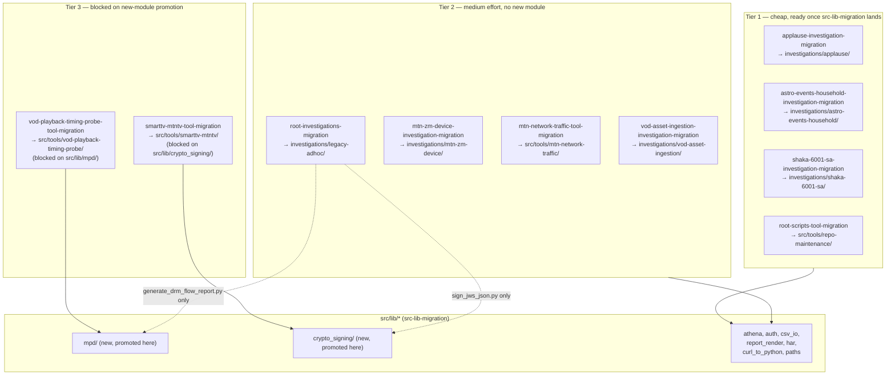

# Reference code gap migration — epic index

> Port the ~166 `.py` files across 10 `github_copilot` reference projects that neither `pipeline-migration` nor `src-lib-migration` currently cover. One epic, 10 stories, tiered by effort/blocking
> rather than one flat list, because — unlike `pipeline-migration`'s two projects — these 10 do not share one clean blocking-dependency set: some are near-zero-effort once `src-lib-migration` lands,
> two are blocked on a new-`src/lib/*`-module decision this index makes below.

`GAP-1` (this folder's original, now-closed task — see `tasks.md`/`stories.md`/`spec.md` for its record) decided this scope shape and made the decisions recorded below. This `README.md`, plus
`prompt.md` (router), supersede the flat-story reading of this folder — a session picking up work here now routes to one of the 10 sub-story folders, not to a root `tasks.md`.

## Why this epic exists

See `prompt.md`'s original "Why this story exists" section (unchanged) — a 2026-09-30 audit found these 10 projects with zero migration plan. `spec.md` is that audit's full file-by-file evidence; read
it before touching any sub-story's first task.

## GAP-1 decisions

### 1. Scope shape: epic, tiered by effort/blocking

Ten stories, landed in this order (record updated per story as each lands — see the table below for current status):

- **Tier 1 — cheap, no new module, ready once `src-lib-migration` lands:** `applause-investigation-migration`, `astro-events-household-investigation-migration`,
  `shaka-6001-sa-investigation-migration`, `root-scripts-tool-migration`.
- **Tier 2 — medium effort, no new module required, needs a category/folder decision applied:** `vod-asset-ingestion-investigation-migration`, `mtn-zm-device-investigation-migration`,
  `mtn-network-traffic-tool-migration`, `root-investigations-migration`.
- **Tier 3 — blocked on a new-`src/lib/*`-module decision (made below, not yet built):** `vod-playback-timing-probe-tool-migration` (needs `mpd`), `smarttv-mtntv-tool-migration` (needs
  `crypto_signing`).

**Correction to `stories.md`'s own hypothesis:** that file's step 2 named both `vod-playback-timing-probe` *and* `mtn-zm-session-device-investigation` as needing "net-new modules first." `spec.md`'s
file-by-file evidence supports that claim only for `vod-playback-timing-probe` (`mpd`/DASH parsing — see below); `mtn-zm-session-device-investigation`'s rollup names tenant/query-registry abstractions
and session-outcome classification as *business logic beyond generic Athena execution*, not a missing shared mechanism — it consumes the existing `athena`/`csv_io`/`report_render`/ `paths` modules
like any Tier 2 project. Moved to Tier 2 on that evidence rather than carried into Tier 3 on the untested hypothesis.

### 2. Category-conflict resolution: flagged a correction

`project-taxonomy/structure.md` and `stories.md` (PT-1 example) both worked-examples `vod-asset-ingestion-mapping` under `experiments/`. `spec.md`'s audit — and that project's own README, which calls
it "a continuous data-gathering exercise" — reads as a recurring-campaign **investigation**, not a one-off experiment. **Corrected**, not accepted as-is: both files updated (`structure.md`'s
`investigations/` and `experiments/` trees, `stories.md`'s PT-1 Experiment-category example), each carrying a dated note citing this decision, per `structure.md`'s own Invariant ("never describe two
different end states"). Target: `investigations/vod-asset-ingestion/`.

**Second discrepancy found, deliberately not corrected (out of this task's named scope):** `spec.md` also suggests `vod-playback-timing-probe` reads as a **tool**, not the `experiments/` category
`structure.md`/`stories.md` currently example it under. `prompt.md`'s "Known conflict, unresolved" section named only the `vod-asset-ingestion-mapping` conflict as GAP-1's job to resolve — this second
one is flagged in both `project-taxonomy` files with a dated note, left for a future `project-taxonomy` session (PT-1 is not yet implemented, so no live doc/code drift exists yet either way).

### 3. New-module promotion decisions

Applying `functional-code-taxonomy` FCT-1's "shared vs. specific" test verbatim (a domain mechanism with **two or more real consumers of the same mechanism** promotes; a single consumer, or two
consumers of only superficially similar mechanisms, stays local until a genuine second consumer appears):

| Candidate | Decision | Consumers |
|---|---|---|
| `mpd`/DASH parser | **Promote** → `src/lib/mpd/` | `vod-playback-timing-probe` `mpd_parser.py`, root `investigations` `generate_drm_flow_report.py` |
| `crypto_signing` (JWS/JSON) | **Promote** → `src/lib/crypto_signing/` | `smarttv-mtntv` `signedJson.py`, root `investigations` `sign_jws_json.py` |
| Playback-session/timing correlator | **Accept local** | `vod-playback-timing-probe` only |
| Network diagnostics (DNS/TLS/MTR/traceroute/WHOIS) | **Accept local** | `mtn-network-traffic` only |
| ADI/XML + asset-identity mapper | **Accept local** | `vod-asset-ingestion-mapping` only |
| Device/user-agent identity | **Accept local** | `shaka-6001-sa-error-analysis` only |

Reasoning, one line per candidate:

- `mpd`: two real consumers of the same MPEG-DASH structure. Blocks `vod-playback-timing-probe-tool-migration`; blocks 1 file in `root-investigations-migration`.
- `crypto_signing`: two real consumers of the same JWS mechanism. Small (~124 LOC combined) but genuine, not size-gated. Blocks `smarttv-mtntv-tool-migration`; blocks 1 file in
  `root-investigations-migration`.
- Playback-session/timing: single true consumer. `mtn-network-traffic`'s flagged overlap is superficial (cURL timing is not playback-flow timing). Revisit if a 3rd consumer appears.
- Network diagnostics: single consumer. Revisit if a 3rd project needs the same DNS/TLS/MTR/traceroute/WHOIS diagnostics.
- ADI/XML mapper: single consumer. Revisit if a 2nd ADI-ingestion project appears.
- Device/UA identity: `mtn-zm-session-device-investigation`'s flagged overlap is only at the tenant-config boundary, not the same UA-parsing mechanism. Revisit if a 3rd consumer appears.

`mpd` and `crypto_signing` are new `src-lib-migration`-epic modules, not built by this epic — this epic only records the promotion decision and the two stories it blocks; wiring them in is
`src-lib-migration`'s own future task, coordinated via the note below.

## Architecture — tiered landing order

## Stories

| Story | Tier | Target | Depends on | Status | Closing SHA |
|---|---|---|---|---|---|
| `applause-investigation-migration/` | 1 | `investigations/applause/` | `src-lib-migration` (athena, csv_io, har, report_render, paths) | ⬜ Not started | — |
| `astro-events-household-investigation-migration/` | 1 | `investigations/astro-events-household/` | `src-lib-migration` (csv_io) | ⬜ Not started | — |
| `shaka-6001-sa-investigation-migration/` | 1 | `investigations/shaka-6001-sa/` | `src-lib-migration` (athena, auth) | ⬜ Not started | — |
| `root-scripts-tool-migration/` | 1 | `src/tools/repo-maintenance/` | `src-lib-migration` (csv_io, report_render); coord. w/ FCT-6 | ⬜ Not started | — |
| `vod-asset-ingestion-investigation-migration/` | 2 | `investigations/vod-asset-ingestion/` | `src-lib-migration` (har, csv_io); `project-taxonomy` PT-1/2/7 | ⬜ Not started | — |
| `mtn-zm-device-investigation-migration/` | 2 | `investigations/mtn-zm-device/` | `src-lib-migration` (athena, csv_io, report_render, paths) | ⬜ Not started | — |
| `mtn-network-traffic-tool-migration/` | 2 | `src/tools/mtn-network-traffic/` | `src-lib-migration` (curl_to_python, report_render, auth) | ⬜ Not started | — |
| `root-investigations-migration/` | 2 | `investigations/legacy-adhoc/` | `src-lib-migration` (report_render); `mpd`/`crypto_signing` for 2 files only | ⬜ Not started | — |
| `vod-playback-timing-probe-tool-migration/` | 3 | `src/tools/vod-playback-timing-probe/` | `src-lib-migration`; **blocked on `src/lib/mpd/`** | ⬜ Not started | — |
| `smarttv-mtntv-tool-migration/` | 3 | `src/tools/smarttv-mtntv/` | **blocked on `src/lib/crypto_signing/`** | ⬜ Not started | — |

Status: ⬜ Not started · 🔄 In progress · ✅ Done. Per-task checkboxes live only in each sub-story's own `tasks.md`; each sub-story currently defines only its first task (an audit + classify + initial
port), per this epic's own "one task per session" convention — further tasks are deliberately not yet written, matching how `GAP-1` itself was scoped.

## Cross-cutting constraints

- Every sub-story's first task states the lib-vs-script test result per file it moves, citing `spec.md`'s own table for that project — not a blanket category assignment.
- No file under `/Users/abhadra/github_copilot` is ever created, edited, or deleted by any story in this epic — read-only reference throughout.
- No live AWS/Athena/Lightstep/network call in any story's tests — mocked collaborators only, matching `src-lib-migration`'s convention.
- Tier 3 stories' first task may audit and skeleton, but must not attempt full migration until their blocking `src/lib/*` module exists — see each story's own `prompt.md` scope guard.
- **2026-10-01:** every sub-story's 2nd+ task (not yet written for any of the 10) must author its class/sequence Mermaid diagrams in its own `stories.md` before any code is written, mirroring
  `src-lib-migration`'s own stated discipline ("diagrams are authored now, at design time, not deferred to the implementing session") — flagged by `docs/plan/pre-implementation-design-review/` finding
  #11 as a process-parity gap, fixed here rather than left for 10 sub-stories to each invent independently.

## Supersession / coordination

- `src-lib-migration`'s own `README.md`/`stories.md` should, once picked up again, be updated to add `mpd` and `crypto_signing` as two additional modules (promoted here, 2026-09-30) — this epic does
  not edit `src-lib-migration`'s files itself; this is the coordination record for whoever picks that epic up next.
- `project-taxonomy`'s `structure.md` and `stories.md` were corrected in this same task's commit (see "GAP-1 decisions" §2 above) — both carry a dated note citing this decision; no further edit is
  required there unless a future session resolves the second, deliberately-unresolved `vod-playback-timing-probe` tension.
- `root-scripts-tool-migration`'s `generate_scripts_registry.py` overlaps `functional-code-taxonomy` FCT-6's own cross-project script registry extension — that story's first task must check whether
  FCT-6 already supersedes it before porting a second copy.
- **2026-10-01:** `docs/plan/flow-correlation-id-logging/` defines the project's FCID (flow-correlation-id) logging convention. Every sub-story's entry script should generate one FCID per run per that
  convention once it implements logging — this epic does not implement the convention itself; this is the coordination record.

## Epic done when

- All 10 sub-stories' `tasks.md` show every task checked, with the lib-vs-script test applied per file (not assumed from directory name).
- `src/lib/mpd/` and `src/lib/crypto_signing/` exist (built by `src-lib-migration`, consumed here) before `vod-playback-timing-probe-tool-migration`/`smarttv-mtntv-tool-migration` land.
- `CONTEXT.md`'s "What Exists" entry for this story reflects "done" and points at the 10 target folders, not this planning folder.
- No file under `/Users/abhadra/github_copilot` was created, edited, or deleted by any story in this epic.
