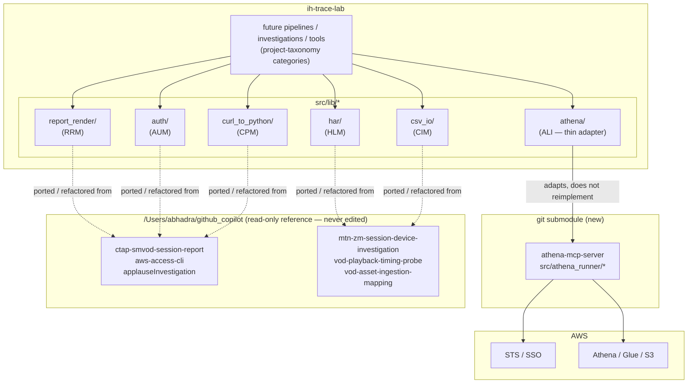

# Src-lib migration — epic index

> Deliver the real, tested implementations behind `functional-code-taxonomy`'s `src/lib/{auth,athena,csv_io,report_render,har,curl_to_python}/` module map — porting/refactoring duplicated logic out of
> `/Users/abhadra/github_copilot` (read-only reference) module by module — plus, for `athena` specifically, wiring in the already-independent `athena-mcp-server` repo as a git submodule rather than
> re-porting code a sibling project already solved. One epic because all six stories share the same blocking dependency, the same read-only-reference constraint, and the same `PYTHON_DESIGN.md`
> Protocol-first design discipline; six stories because each module has its own originals, its own risk profile, and lands independently.

## Why this epic exists

`docs/plan/functional-code-taxonomy/` (design-only: module map, `Protocol` skeletons for the three riskiest modules, a cross-project script registry) deliberately left every *concrete* implementation
to a follow-up, "triggered the first time an actual pipeline/investigation/tool needs them" (its own stated YAGNI stance). This epic is that follow-up, authorized explicitly rather than waiting for an
organic trigger.

While scoping story 1 (`athena`), auditing `/Users/abhadra/myWork/myOffice/athena-mcp-server` found the athena duplication problem already solved *outside* `ih-trace-lab`: it is a fully independent,
tested (101 tests), pip-installable repo (`src/athena_runner/*`: `config`, `aws_clients`, `query_executor`, `result_downloader`, `sso_auth`, `sso_profiles`, `tenants`, `logging_setup`, `date_utils`,
`exceptions`) already ported from `github_copilot/oasis-athena-mcp` (itself ported from `aws-access-cli/scripts/athena_runner/`). It is not yet wired into `ih-trace-lab` as a submodule. Re-porting
that logic a *fifth* time would recreate the exact problem `functional-code-taxonomy` exists to stop. So `athena-lib-integration` wires the existing submodule in and adapts to it; it does not
reimplement.

## Scope decisions

- **Blocked on `functional-code-taxonomy`.** No story in this epic starts implementation before `functional-code-taxonomy`'s FCT-1 (module map), FCT-2 (`athena`/`report_render`/`har` `Protocol`
  skeletons), and FCT-7 (`PathResolver`) land — this epic implements *against* those artifacts, it does not redesign them. Confirmed with the epic requester, 2026-09-30.
- **`athena` is integration, not migration.** `athena-lib-integration` adds `athena-mcp-server` as a git submodule and writes a thin adapter; it does not port `query_executor.py`/`aws_clients.py`
  logic into `ih-trace-lab` a second time.
- **The other five modules are real ports.** `report_render`, `har`, `auth`, `csv_io`, `curl_to_python` each get a concrete implementation in `src/lib/<module>/`, migrated/refactored (not copied
  verbatim) from their `github_copilot` originals, following the shape `PYTHON_DESIGN.md` prescribes (`Protocol`-based DI, Strategy/Template Method where a decision trigger applies).
- **`auth`, `csv_io`, `curl_to_python` gain their `Protocol` skeletons here**, not in `functional-code-taxonomy` — that story explicitly deferred those three "as a follow-up once a real consumer needs
  them"; this epic is that consumer. Each such story's first task defines the `Protocol` before the concrete class, mirroring FCT-2's own pattern.
- **Diagrams are authored now, at design time**, not deferred to the implementing session: each story below carries a Mermaid class diagram (Protocol + concrete implementer) and a Mermaid sequence
  diagram (primary runtime flow) in its own `stories.md`. This document carries the epic-level architecture diagram.
- **No file under `/Users/abhadra/github_copilot` is ever created, edited, or deleted** by any story in this epic — read-only reference throughout, per this project's `CONTEXT.md` constraint.

## Architecture

## Stories

| Story | Purpose | Status | Depends on | Closing SHA |
|---|---|---|---|---|
| `athena-lib-integration/` | Submodule `athena-mcp-server` + thin `src/lib/athena/` adapter | ⬜ Not started | `functional-code-taxonomy` FCT-1/FCT-2 | — |
| `report-render-lib-migration/` | Port 8+ duplicated CSV/report writers → `src/lib/report_render/` | ⬜ Not started | `functional-code-taxonomy` FCT-1/FCT-2 | — |
| `har-lib-migration/` | Port 4 duplicated HAR-entry loaders → `src/lib/har/` | ⬜ Not started | `functional-code-taxonomy` FCT-1/FCT-2 | — |
| `auth-lib-migration/` | Consolidate AWS SSO auth helpers → `src/lib/auth/` (new `Protocol`) | ⬜ Not started | FCT-1, `athena-lib-integration` (reuses `sso_auth` shape) | — |
| `csv-io-lib-migration/` | Consolidate raw CSV I/O → `src/lib/csv_io/` (new `Protocol`) | ⬜ Not started | `functional-code-taxonomy` FCT-1 | — |
| `curl-to-python-lib-migration/` | Consolidate curl→Python conversion → `src/lib/curl_to_python/` (new `Protocol`) | ⬜ Not started | `functional-code-taxonomy` FCT-1 | — |

Status: ⬜ Not started · 🔄 In progress · ✅ Done. This column is the epic's progress view — per-task checkboxes live only in each sub-story's `tasks.md`.

## Cross-cutting constraints

- Every story cites `PYTHON_DESIGN.md`'s specific trigger it applies (most commonly DIP: constructor-injected collaborators, never self-constructed) in its own `stories.md`, not just a generic
  reference to the doc.
- Every story's `Protocol` (new or FCT-2-supplied) is `@runtime_checkable` where instance checks are meaningful, with a conformance test pair (a minimal conforming stub passes `isinstance`, a
  non-conforming one fails) — matches FCT-2's existing pattern exactly.
- No story adds a project-specific business rule to `src/lib/*` — only domain-mechanism logic (Athena execution, CSV/report I/O, HAR parsing, auth, curl conversion) belongs here; anything
  campaign/case-specific stays local to a future consumer's own `scripts/`.
- No live AWS/network calls in any story's tests — mocked `boto3`/filesystem only, matching `athena-mcp-server`'s own existing test convention.

## Supersession / coordination

- `functional-code-taxonomy` FCT-1 (module map + replaced-originals citations) and FCT-3 (migration/ownership table) must be updated, when that story is picked up, to cite `athena-mcp-server` as the
  canonical `athena` implementation — not a fifth from-scratch port. This epic does not edit `functional-code-taxonomy`'s files itself (that story is not yet started); it leaves this note as the
  coordination record.
- **2026-10-01:** `docs/plan/flow-correlation-id-logging/` defines the project's FCID (flow-correlation-id) logging convention — `contextvars`-propagated, auto-injected via a `logging.Filter`, no
  manual `fcid` parameter on any adapter method. `athena-lib-integration`'s ALI-2 adapter (and every other module's adapter here) should adopt that convention's log-line shape once implemented. This
  epic does not implement the convention itself; this is the coordination record.
- `athena-lib-integration` must stay reconciled with `athena-mcp-server`'s own `CONTEXT.md` "Known open item" (the `aws-access-cli` sibling-checkout namespace-package merge for
  `tool_config.py::_load_mtn_registry`) — that fragility is upstream of this epic, not introduced by it, but the adapter must not paper over it silently if it resurfaces.

## Epic done when

- **athena-lib-integration** — `athena-mcp-server` is a pinned git submodule; `src/lib/athena/adapter.py` implements FCT-2's `Protocol` by delegating to `athena_runner`, with passing mocked tests; no
  `query_executor`/`aws_clients` logic is duplicated in `ih-trace-lab`.
- **report-render-lib-migration** — `src/lib/report_render/` has a concrete Strategy-per-format writer replacing all cited `github_copilot` originals, with passing tests and a `Protocol` conformance
  pair.
- **har-lib-migration** — `src/lib/har/` has a concrete loader replacing all four cited originals, with passing tests and a `Protocol` conformance pair.
- **auth-lib-migration** — `src/lib/auth/protocols.py` + concrete implementer exist, DIP-injected, with passing tests.
- **csv-io-lib-migration** — `src/lib/csv_io/protocols.py` + concrete implementer exist, DIP-injected, with passing tests.
- **curl-to-python-lib-migration** — `src/lib/curl_to_python/protocols.py` + concrete implementer exist, with passing tests.
- No file under `/Users/abhadra/github_copilot` was created, edited, or deleted by any story in this epic.
