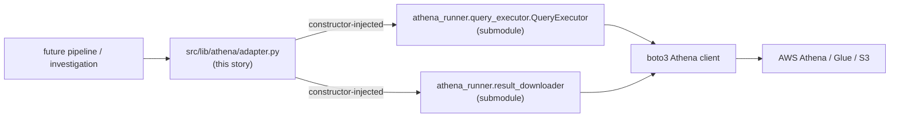
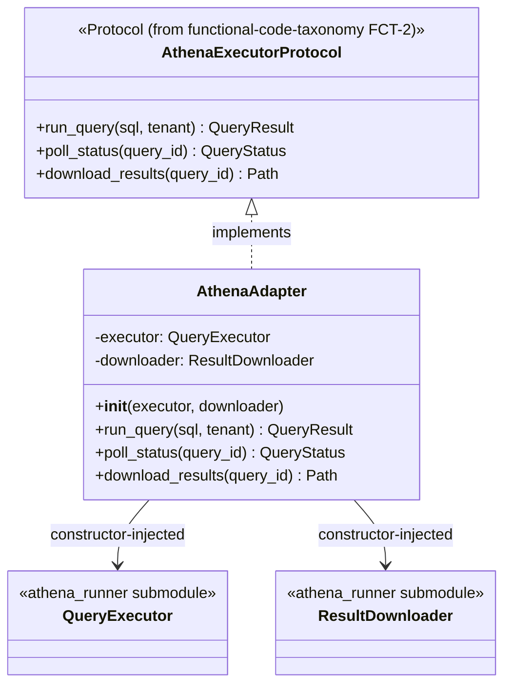

# Athena lib integration — story specs

> One task per session. Find the first unchecked item in `tasks.md`. That is your only task. Full implementation rules live in this project's `AGENTS.md` + `PYTHON_DESIGN.md`. After each task: set
> `SHA:` on the task line + tick the box, update the story status summary, add one line to your backlog/session-log file.

## Architecture — where this story sits

---

## ALI-1 — Add `athena-mcp-server` as a pinned git submodule

**Files to change / create:**
- `.gitmodules` — new `[submodule "athena-mcp-server"]` entry, path e.g. `vendor/athena-mcp-server`, url `https://github.com/abhadrasyna/athena-mcp-server.git`.
- `README.md` (project root) — add a setup step: `git submodule update --init --recursive`.
- `docs/guides/` — short note (append to an existing setup guide, or new `docs/guides/submodules.md` if none exists) on what the submodule provides and how to update its pin.

**What to implement:**

1. `git submodule add https://github.com/abhadrasyna/athena-mcp-server.git vendor/athena-mcp-server`.
2. Pin to the current `HEAD` commit of that repo at add-time (submodules pin by commit automatically — confirm the recorded SHA matches what's expected, no floating branch).
3. Document the init step and the one known open item inherited from that repo's own `CONTEXT.md` (the `aws-access-cli` sibling-checkout namespace-package merge in
   `tool_config.py::_load_mtn_registry`) as a "not this story's problem, but be aware" note — this story's adapter (ALI-2) does not touch `tool_config.py` at all, only the generic `athena_runner`
   package, precisely to avoid depending on that fragile part.

**Tests (no network, no real external services):**
- N/A — this task is repo plumbing, no test gate. Verify instead: a fresh `git clone --recurse-submodules` (or `clone` + `submodule update --init`) of `ih-trace-lab` reproduces the submodule checkout
  with no manual steps beyond the documented command.

**Commit:** `chore(athena): add athena-mcp-server as git submodule`

---

## ALI-2 — `src/lib/athena/adapter.py`: DIP-compliant adapter

**Files to change / create:**
- `src/lib/athena/adapter.py` — new file.
- `src/lib/athena/__init__.py` — package marker.

**Before writing this file:** re-read `functional-code-taxonomy` FCT-2's `src/lib/athena/protocols.py` — this adapter must implement that exact `Protocol`, not a new one invented here. If FCT-2 is not
yet landed, this task cannot start (see `prompt.md`'s hard gate).

**What to implement:**

1. `PYTHON_DESIGN.md` trigger applied: **DIP** — "a class constructs its own collaborator directly instead of receiving it." `AthenaAdapter.__init__` receives an `athena_runner.query_executor`
   instance (or a narrower `Protocol` over it) and a `result_downloader` collaborator as constructor arguments — it never calls `boto3.client(...)` or constructs `QueryExecutor()` itself.
2. Each method on `AthenaAdapter` is a one-line-to-few-line delegation to the injected `athena_runner` collaborator, translated to/from FCT-2's `Protocol` types where the shapes differ.
3. No SQL text, no per-tenant config, no `tool_config.py`-style registry logic lands here — that stays in the submodule or in a future consumer, per this epic's cross-cutting constraint ("no
   project-specific business rule in `src/lib/*`").

**Class diagram:**

**Tests (no network, no real external services):**
- `test_adapter_delegates_run_query` — a fake `QueryExecutor` records the call; adapter returns its result untranslated (or correctly translated).
- `test_adapter_constructor_requires_injection` — instantiating without collaborators raises (no silent default construction of a real `boto3` client).

**Commit:** `feat(athena): add DIP-compliant adapter over athena_runner`

---

## ALI-3 — Tests: mocked `athena_runner`, `Protocol` conformance pair

**Files to change / create:**
- `tests/lib/athena/test_adapter.py` — new.
- `tests/lib/athena/test_protocol_conformance.py` — new, mirrors FCT-2's own conformance-test pattern.

**What to implement:**

1. Mock/fake `athena_runner.query_executor.QueryExecutor` and `athena_runner.result_downloader` — no real `boto3` calls, no live AWS/network, matching `athena-mcp-server`'s own existing test
   convention (mocked-boto3 unit tests).
2. `test_adapter_satisfies_protocol` — `isinstance(AthenaAdapter(fake_executor, fake_downloader), AthenaExecutorProtocol)` is `True`.
3. `test_non_conforming_stub_fails_protocol` — a stub missing one method is `False` under `isinstance`.

**Commit:** `test(athena): mock athena_runner + Protocol conformance`

---

## ALI-4 — Doc/`CONTEXT.md` pointers

**Files to change / create:**
- `CONTEXT.md` — one new "What Exists" line for this story.
- Project root `README.md` (or `docs/guides/`) — submodule init step, if not already covered by ALI-1.
- `docs/plan/src-lib-migration/README.md` — update this story's row in the "Stories" status table to ✅ Done with closing SHA (final task of the story).

**What to implement:**

1. `CONTEXT.md` line: `src/lib/athena/adapter.py` — thin DIP adapter over the `athena-mcp-server` git submodule's `athena_runner` package; no Athena execution logic duplicated in `ih-trace-lab`.
2. Confirm no drift: re-read `docs/plan/src-lib-migration/README.md`'s Supersession/coordination note and confirm it still accurately describes the landed state.

**Tests:** N/A — docs only.

**Commit:** `docs(athena): point CONTEXT.md at the new adapter + submodule`
