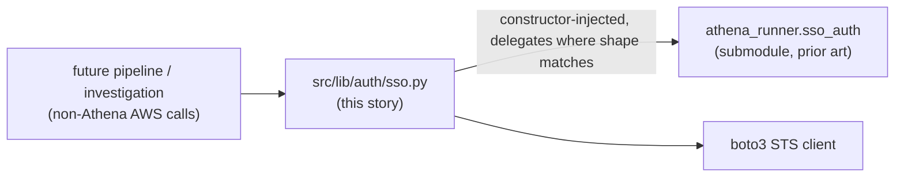
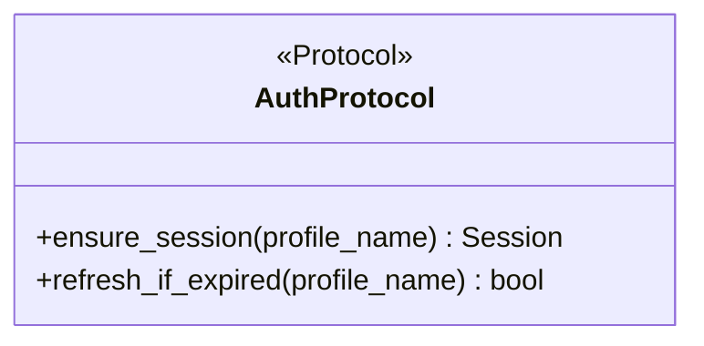
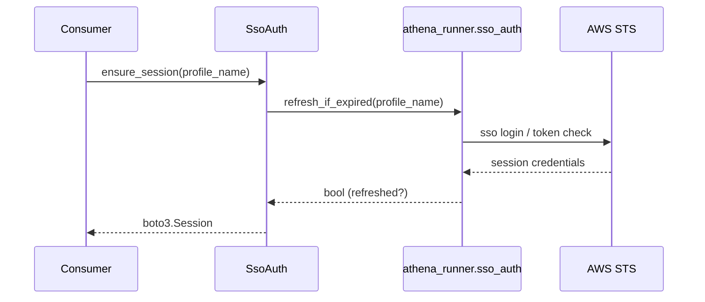

# Auth lib migration — story specs

> One task per session. Find the first unchecked item in `tasks.md`. That is your only task. After each task: set `SHA:` on the task line + tick the box, update the story status summary, add one line
> to your backlog/session-log file.

## Architecture — where this story sits

---

## AUM-1 — `src/lib/auth/protocols.py`: new `AuthProtocol`

**Files to change / create:**
- `src/lib/auth/protocols.py` — new.
- `src/lib/auth/__init__.py` — package marker.

**Before writing this file:** read `athena_runner/sso_auth.py` and `sso_profiles.py` (via the `athena-mcp-server` submodule, landed by `athena-lib-integration`) in full — this `Protocol` generalizes
their public surface, it does not invent one from scratch.

**What to implement:**

1. `PYTHON_DESIGN.md` trigger applied: **DIP** (interface side) — define `AuthProtocol` as a `typing.Protocol`, `@runtime_checkable`, with method signatures only (`...` bodies), matching FCT-2's exact
   authoring convention (no deviation in style).
2. Cover, at minimum: `ensure_session(profile_name) -> boto3.Session` (or equivalent) and `refresh_if_expired(profile_name) -> bool`, mirroring `sso_auth`'s actual public functions — do not add
   speculative methods beyond what `sso_auth` already proves is needed.

**Class diagram:**

**Tests (no network, no real external services):**
- `test_conforming_stub_satisfies_protocol` — a minimal hand-written class implementing both methods passes `isinstance`.
- `test_non_conforming_stub_fails_protocol` — a stub missing `refresh_if_expired` fails.

**Commit:** `feat(auth): define AuthProtocol from sso_auth prior art`

---

## AUM-2 — `src/lib/auth/sso.py`: concrete implementer

**Files to change / create:**
- `src/lib/auth/sso.py` — new.

**What to implement:**

1. `SsoAuth` class implements `AuthProtocol`, constructor-injected with an `athena_runner.sso_auth`-shaped collaborator (or the module itself, if it exposes free functions rather than a class — match
   whatever `sso_auth.py` actually provides, confirmed by AUM-1's reading).
2. No re-implementation of the SSO refresh polling loop — delegate to the injected collaborator.

**Sequence diagram:**

**Tests (no network, no real external services):**
- `test_ensure_session_delegates_to_upstream` — fake collaborator records the call.
- `test_ensure_session_does_not_construct_own_boto3_client` — verify no direct `boto3.client` call inside `SsoAuth`.

**Commit:** `feat(auth): add SsoAuth implementer delegating to athena_runner`

---

## AUM-3 — Tests + `Protocol` conformance pair

**Files to change / create:**
- `tests/lib/auth/test_sso.py` — new.
- `tests/lib/auth/test_protocol_conformance.py` — new.

**What to implement:**

1. Mocked upstream collaborator, no live AWS/network calls.
2. `Protocol` conformance pair mirroring AUM-1's pattern, now against the concrete `SsoAuth` class.

**Commit:** `test(auth): sso tests + Protocol conformance`

---

## AUM-4 — Doc/`CONTEXT.md` pointers

**Files to change / create:**
- `CONTEXT.md` — one new "What Exists" line.
- `docs/plan/src-lib-migration/README.md` — update this story's row to ✅ Done with closing SHA.

**What to implement:**

1. `CONTEXT.md` line: `src/lib/auth/sso.py` — AWS SSO auth `Protocol` + implementer, generalized from `athena_runner.sso_auth` prior art.

**Tests:** N/A — docs only.

**Commit:** `docs(auth): point CONTEXT.md at the new auth module`
