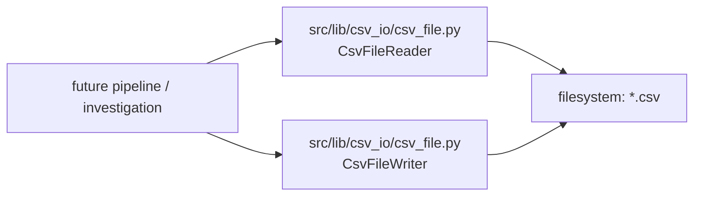
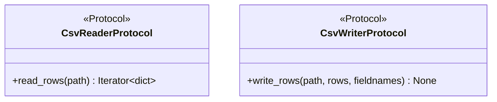
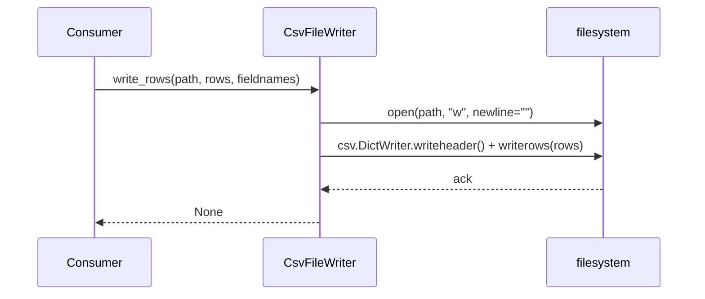

# Csv io lib migration — story specs

> One task per session. Find the first unchecked item in `tasks.md`. That is your only task. After each task: set `SHA:` on the task line + tick the box, update the story status summary, add one line
> to your backlog/session-log file.

## Architecture — where this story sits

---

## CIM-1 — `src/lib/csv_io/protocols.py`: split reader/writer protocols

**Files to change / create:**
- `src/lib/csv_io/protocols.py` — new.
- `src/lib/csv_io/__init__.py` — package marker.

**What to implement:**

1. `PYTHON_DESIGN.md` trigger applied: **ISP** — "a `Protocol` has grown methods only some implementers use." Define `CsvReaderProtocol` (`read_rows(path) -> Iterator[dict]`) and `CsvWriterProtocol`
   (`write_rows(path, rows, fieldnames) -> None`) as two separate `Protocol`s, not one combined `CsvIoProtocol` — a read-only consumer never needs to implement `write_rows`, and vice versa.
2. Both `@runtime_checkable`, method signatures only.

**Class diagram:**

**Tests (no network, no real external services):**
- `test_conforming_reader_satisfies_protocol` / `test_conforming_writer_satisfies_protocol`.
- `test_reader_and_writer_protocols_are_independent` — a class implementing only one of the two satisfies only that one under `isinstance`.

**Commit:** `feat(csv_io): define split reader/writer protocols`

---

## CIM-2 — `src/lib/csv_io/csv_file.py`: concrete implementer(s)

**Files to change / create:**
- `src/lib/csv_io/csv_file.py` — new.

**What to implement:**

1. `CsvFileReader` implements `CsvReaderProtocol` using the stdlib `csv.DictReader` — no custom parsing beyond what `csv` already provides (Zen: "simple is better than complex").
2. `CsvFileWriter` implements `CsvWriterProtocol` using `csv.DictWriter`.
3. Neither class holds project-specific column/schema knowledge — `fieldnames` is always supplied by the caller.

**Sequence diagram:**

**Tests (no network, no real external services):**
- `test_reader_reads_expected_rows` — fixture CSV, assert parsed dicts.
- `test_writer_writes_expected_rows` — `tmp_path`, assert round-trip via `CsvFileReader`.

**Commit:** `feat(csv_io): add CsvFileReader/CsvFileWriter`

---

## CIM-3 — Tests + `Protocol` conformance pairs

**Files to change / create:**
- `tests/lib/csv_io/test_csv_file.py` — new.
- `tests/lib/csv_io/test_protocol_conformance.py` — new.

**What to implement:**

1. `tmp_path`-based round-trip test (write then read, assert equality).
2. `Protocol` conformance pairs for both `CsvReaderProtocol` and `CsvWriterProtocol`.

**Commit:** `test(csv_io): reader/writer tests + Protocol conformance`

---

## CIM-4 — Doc/`CONTEXT.md` pointers

**Files to change / create:**
- `CONTEXT.md` — one new "What Exists" line.
- `docs/plan/src-lib-migration/README.md` — update this story's row to ✅ Done with closing SHA.

**What to implement:**

1. `CONTEXT.md` line: `src/lib/csv_io/csv_file.py` — split reader/writer `Protocol`s + stdlib-backed implementer for raw CSV I/O, distinct from `report_render`'s formatted output.

**Tests:** N/A — docs only.

**Commit:** `docs(csv_io): point CONTEXT.md at the new csv_io module`
