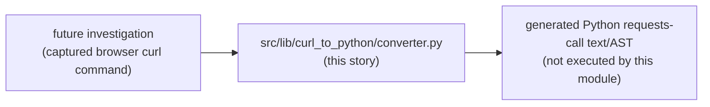
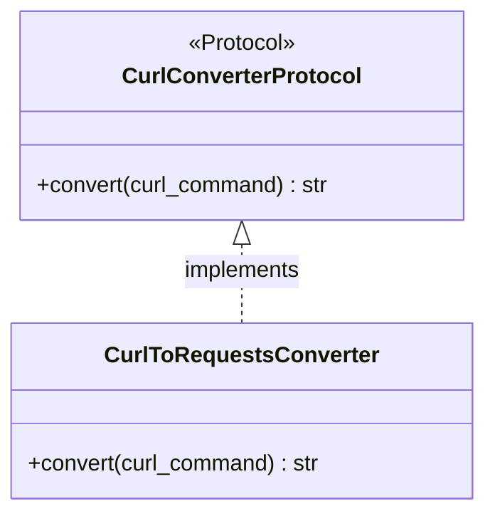
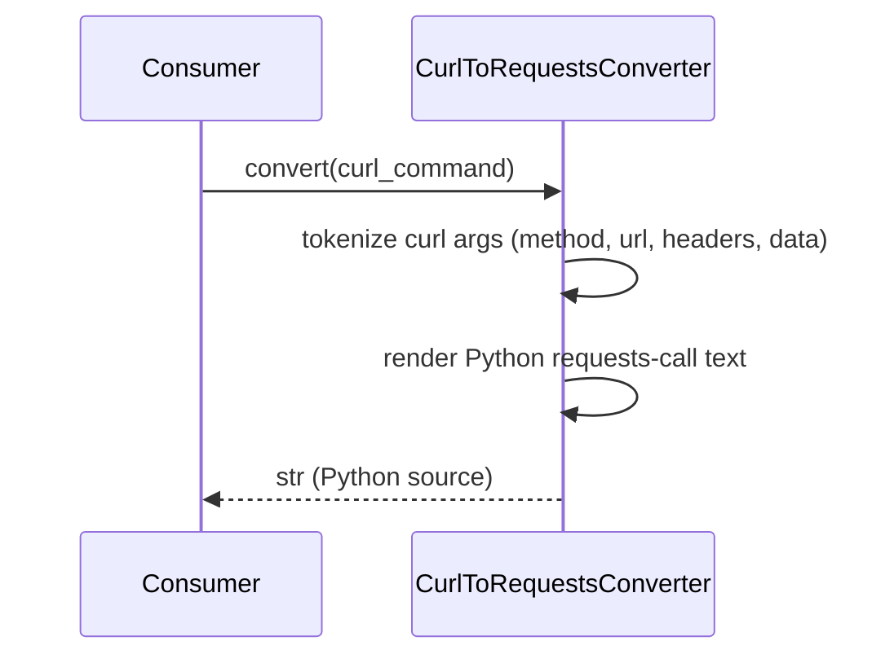

# Curl to python lib migration — story specs

> One task per session. Find the first unchecked item in `tasks.md`. That is your only task. After each task: set `SHA:` on the task line + tick the box, update the story status summary, add one line
> to your backlog/session-log file.

## Architecture — where this story sits

---

## CPM-1 — Confirm/derive replaced-originals citation

**Files to change / create:**
- `stories.md` (this file) — record the finding as a subsection under CPM-2 below.

**What to implement:**

1. Re-read `functional-code-taxonomy`'s FCT-1 audit text for any `curl_to_python`-relevant file citation (search for "curl" across its `prompt.md`/`stories.md`).
2. If none exists, record explicitly: "No specific `github_copilot` original was cited for `curl_to_python` in the FCT-1 audit; this module is built ahead of a proven-duplication trigger per this
   epic's explicit authorization (2026-09-30 session)."
3. If a citation is found on re-read, record it here instead and adjust CPM-3's implementer to match its actual shape rather than inventing one.

**Tests:** N/A — audit/analysis task.

**Commit:** `docs(curl_to_python): confirm replaced-originals citation`

---

## CPM-2 — `src/lib/curl_to_python/protocols.py`: new `CurlConverterProtocol`

**Files to change / create:**
- `src/lib/curl_to_python/protocols.py` — new.
- `src/lib/curl_to_python/__init__.py` — package marker.

**What to implement:**

1. `PYTHON_DESIGN.md` trigger applied: **SRP** — parsing belongs to one function/class, not scattered inline per investigation script.
2. Define `CurlConverterProtocol` (`convert(curl_command: str) -> str`, returning generated Python source text) as a `Protocol`, `@runtime_checkable`, method signature only.

**Class diagram:**

**Tests (no network, no real external services):**
- `test_conforming_stub_satisfies_protocol`.
- `test_non_conforming_stub_fails_protocol`.

**Commit:** `feat(curl_to_python): define CurlConverterProtocol`

---

## CPM-3 — `src/lib/curl_to_python/converter.py`: concrete implementer

**Files to change / create:**
- `src/lib/curl_to_python/converter.py` — new.

**What to implement:**

1. `CurlToRequestsConverter.convert(curl_command)` parses a curl command string (method, URL, headers, data) and returns Python source text using the `requests` library shape — text generation only,
   no `exec`/`eval`, no network call.
2. `PYTHON_DESIGN.md` trigger applied: **Factory Method** — if multiple output shapes are ever needed (e.g. `requests` vs. `httpx`), a factory selects the converter; this task builds only the one
   proven shape (`requests`), per YAGNI.

**Sequence diagram:**

**Tests (no network, no real external services):**
- `test_convert_get_request` — simple `curl -X GET <url>` → expected Python text.
- `test_convert_post_with_headers_and_data` — assert headers/data dict rendered correctly.
- `test_convert_does_not_execute_request` — assert no network call is made during conversion.

**Commit:** `feat(curl_to_python): add CurlToRequestsConverter`

---

## CPM-4 — Tests + `Protocol` conformance pair

**Files to change / create:**
- `tests/lib/curl_to_python/test_converter.py` — new.
- `tests/lib/curl_to_python/test_protocol_conformance.py` — new.

**What to implement:**

1. Cover CPM-3's test list plus edge cases (multi-line curl with `\` continuations, quoted arguments).
2. `Protocol` conformance pair against the concrete `CurlToRequestsConverter`.

**Commit:** `test(curl_to_python): converter tests + Protocol conformance`

---

## CPM-5 — Doc/`CONTEXT.md` pointers

**Files to change / create:**
- `CONTEXT.md` — one new "What Exists" line.
- `docs/plan/src-lib-migration/README.md` — update this story's row to ✅ Done with closing SHA.

**What to implement:**

1. `CONTEXT.md` line: `src/lib/curl_to_python/converter.py` — curl→Python `requests`-call converter, `Protocol`-based, built ahead of a proven-duplication trigger per this epic's explicit
   authorization (cite CPM-1's finding).

**Tests:** N/A — docs only.

**Commit:** `docs(curl_to_python): point CONTEXT.md at the new converter module`
