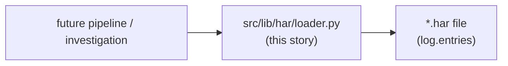
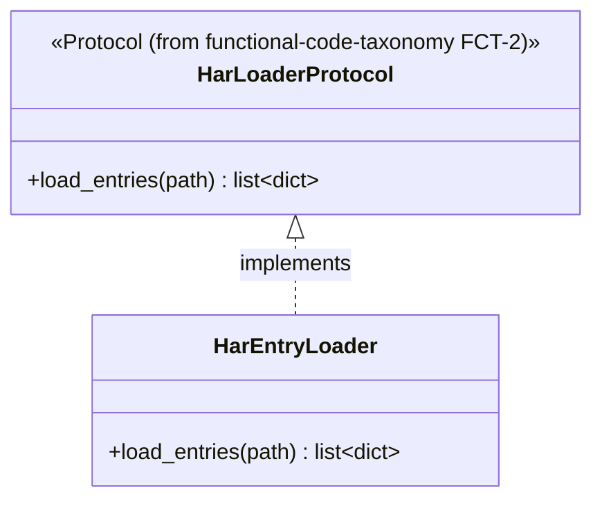
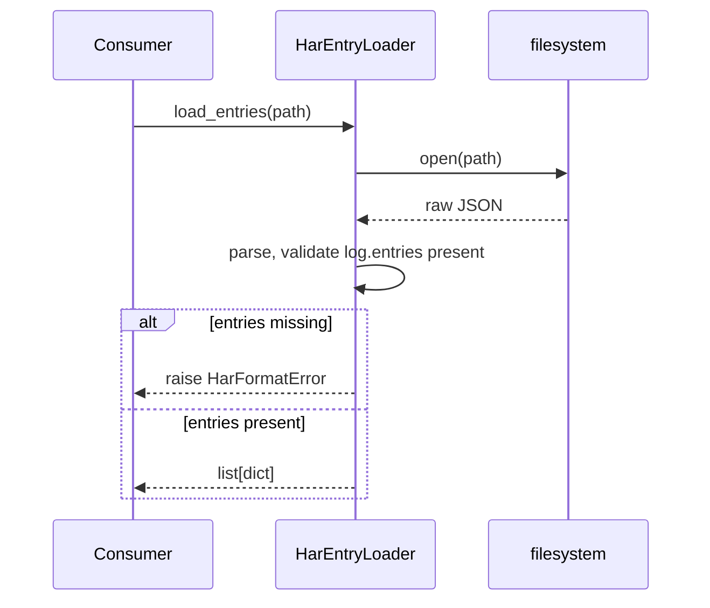

# Har lib migration — story specs

> One task per session. Find the first unchecked item in `tasks.md`. That is your only task. After each task: set `SHA:` on the task line + tick the box, update the story status summary, add one line
> to your backlog/session-log file.

## Architecture — where this story sits

---

## HLM-1 — Re-confirm audit list

**Files to change / create:**
- `stories.md` (this file) — append the confirmed list as a subsection under HLM-2 below.

**What to implement:**

1. Re-read (read-only) `applauseInvestigation/scripts/analyze_har.py::iter_entries()`, `vod-playback-timing-probe/scripts/extract_content_ids_from_har.py::_load_entries()`,
   `vod-playback-timing-probe/scripts/summarize_har_playbacks.py::_load_entries()`, and `vod-asset-ingestion-mapping/scripts/lib/har_parser.py::load_json_entries()`.
2. Confirm they are still shape-identical (all load `log.entries` from a HAR JSON file) or note any divergence found since the FCT-1 audit.

**Tests:** N/A — audit/analysis task.

**Commit:** `docs(har): confirm loader audit`

---

## HLM-2 — `src/lib/har/loader.py`: concrete loader

**Files to change / create:**
- `src/lib/har/loader.py` — new.
- `src/lib/har/__init__.py` — package marker.

**Before writing this file:** re-read `functional-code-taxonomy` FCT-2's `src/lib/har/protocols.py` (seeded from `vod-asset-ingestion-mapping`'s `load_json_entries()`) — implement that `Protocol`
exactly.

**What to implement:**

1. `PYTHON_DESIGN.md` trigger applied: **SRP** — "a pure domain-mechanism function has no business being copy-pasted per project." One function/class here replaces all four originals.
2. Accept a file path (or open file handle) as an argument — no hardcoded/project-specific path.
3. Raise a clear, specific exception (not a bare `except`) on malformed HAR JSON (missing `log.entries`) — matches this project's "fail loudly, no silently-wrong partial results" convention.

**Class diagram:**

**Sequence diagram:**

**Tests (no network, no real external services):**
- `test_load_entries_returns_list` — fixture HAR file, assert entry count/shape.
- `test_load_entries_raises_on_malformed_har` — fixture missing `log.entries`, assert specific exception type.

**Commit:** `feat(har): add HAR entry loader`

---

## HLM-3 — Tests + `Protocol` conformance pair

**Files to change / create:**
- `tests/lib/har/test_loader.py` — new.
- `tests/lib/har/test_protocol_conformance.py` — new.
- `tests/lib/har/fixtures/` — sample `.har` fixture files (valid + malformed).

**What to implement:**

1. `test_conforming_loader_satisfies_protocol` — `isinstance(HarEntryLoader(), HarLoaderProtocol)` is `True`.
2. `test_non_conforming_stub_fails_protocol` — a stub missing `load_entries` is `False`.

**Commit:** `test(har): loader tests + Protocol conformance`

---

## HLM-4 — Doc/`CONTEXT.md` pointers

**Files to change / create:**
- `CONTEXT.md` — one new "What Exists" line.
- `docs/plan/src-lib-migration/README.md` — update this story's row to ✅ Done with closing SHA.

**What to implement:**

1. `CONTEXT.md` line: `src/lib/har/loader.py` — HAR entry loader replacing the 4 duplicated `github_copilot` originals (cite HLM-1's confirmed list).

**Tests:** N/A — docs only.

**Commit:** `docs(har): point CONTEXT.md at the new loader`
