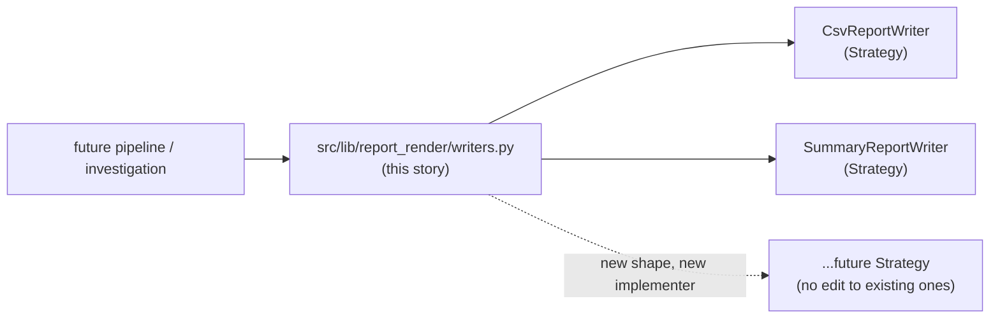
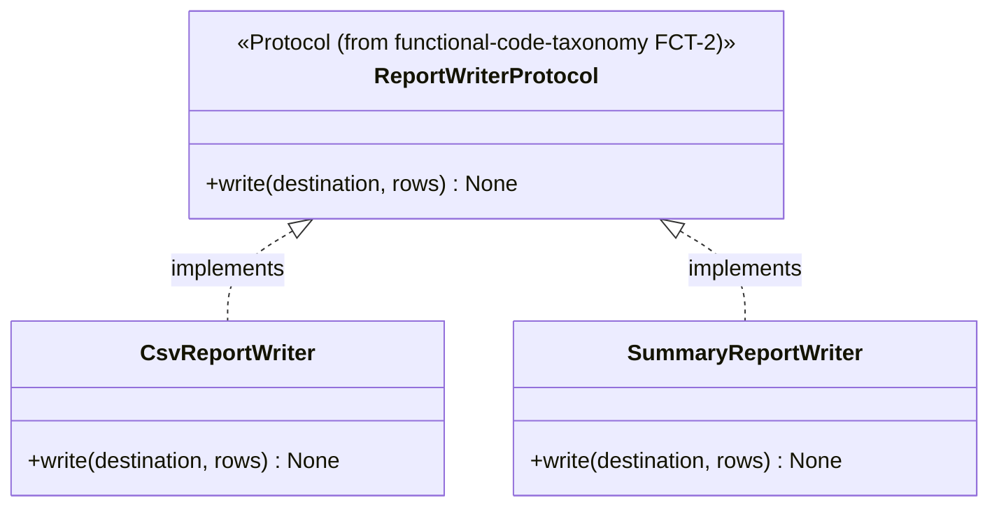
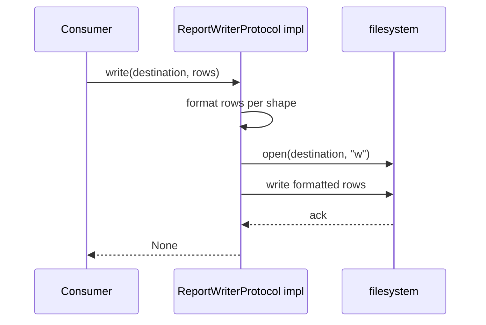

# Report render lib migration — story specs

> One task per session. Find the first unchecked item in `tasks.md`. That is your only task. After each task: set `SHA:` on the task line + tick the box, update the story status summary, add one line
> to your backlog/session-log file.

## Architecture — where this story sits

---

## RRM-1 — Re-confirm audit list, group by shape

**Files to change / create:**
- `stories.md` (this file) — append the confirmed list as a subsection under RRM-2 below, before writing code.

**What to implement:**

1. Re-read (read-only) each of: `ctap-smvod-session-report`, `aws-access-cli`, `applauseInvestigation`, `mtn-zm-session-device-investigation`, `vod-playback-timing-probe` writer files cited in
   `functional-code-taxonomy` FCT-1's audit.
2. Group by output *shape* (e.g. "flat CSV, one row per record" vs. "grouped summary with subtotal rows") rather than by source project — two projects with identical shape need only one Strategy
   implementer between them.
3. Record the final grouped list with file citations in this section, so RRM-2 has a fixed target instead of re-deriving it.

**Tests:** N/A — audit/analysis task, no code changes.

**Commit:** `docs(report_render): confirm writer audit, group by shape`

---

## RRM-2 — `src/lib/report_render/writers.py`: Strategy implementer(s)

**Files to change / create:**
- `src/lib/report_render/writers.py` — new.
- `src/lib/report_render/__init__.py` — package marker.

**Before writing this file:** re-read `functional-code-taxonomy` FCT-2's `src/lib/report_render/protocols.py` — implement that `Protocol` exactly, do not invent a new one.

**What to implement:**

1. `PYTHON_DESIGN.md` trigger applied: **OCP** — "adding a new report format is a new copy-pasted `to_csv`/print-loop." Instead: one Strategy implementer class per shape from RRM-1's list, each
   satisfying FCT-2's `Protocol`; a new shape in future is a new implementer class, never an edited existing one.
2. Each implementer takes its output target (file handle or path) and row data via method arguments — no implementer opens its own file path from a hardcoded/global location (keeps it
   project-agnostic, matches the "no project-specific business rule in `src/lib/*`" cross-cutting constraint).

**Class diagram:**

**Sequence diagram (typical write flow):**

**Tests (no network, no real external services):**
- `test_csv_writer_writes_expected_rows` — temp file, assert exact content.
- `test_summary_writer_includes_subtotals` — temp file, assert subtotal rows present.

**Commit:** `feat(report_render): add Strategy-based report writers`

---

## RRM-3 — Tests + `Protocol` conformance pair

**Files to change / create:**
- `tests/lib/report_render/test_writers.py` — new.
- `tests/lib/report_render/test_protocol_conformance.py` — new.

**What to implement:**

1. `test_conforming_writer_satisfies_protocol` — `isinstance(CsvReportWriter(), ReportWriterProtocol)` is `True`.
2. `test_non_conforming_stub_fails_protocol` — a stub missing `write` is `False`.
3. All writer tests use `tmp_path` (pytest fixture) — no real project directories touched.

**Commit:** `test(report_render): writer tests + Protocol conformance`

---

## RRM-4 — Doc/`CONTEXT.md` pointers

**Files to change / create:**
- `CONTEXT.md` — one new "What Exists" line.
- `docs/plan/src-lib-migration/README.md` — update this story's row to ✅ Done with closing SHA.

**What to implement:**

1. `CONTEXT.md` line: `src/lib/report_render/writers.py` — Strategy-based report writers replacing the 8+ duplicated `github_copilot` originals (cite RRM-1's grouped list).

**Tests:** N/A — docs only.

**Commit:** `docs(report_render): point CONTEXT.md at the new writers`
