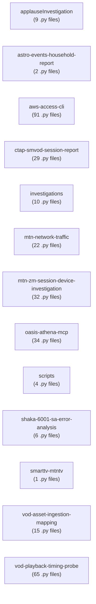

# Reference Repository Python Overview

Auto-generated by `scripts/reference_diagram/main.py` — do not edit by hand; re-run the generator instead after `github_copilot` changes.

Scanned `github_copilot`: 13 top-level projects, 320 Python files (excluding `.venv`, `.git`, `__pycache__`, `.obsidian`, `node_modules`). Cross-project edges exclude generic per-project package names
(config, lib, logs, scripts, src, tests, tooling).

## Project overview

## File counts

| Project | .py files | Imports (detected) | Unparsable (fallback) |
|---|---|---|---|
| `applauseInvestigation` | 9 | — | — |
| `astro-events-household-report` | 2 | — | — |
| `aws-access-cli` | 91 | — | — |
| `ctap-smvod-session-report` | 29 | — | — |
| `investigations` | 10 | — | — |
| `mtn-network-traffic` | 22 | — | — |
| `mtn-zm-session-device-investigation` | 32 | — | — |
| `oasis-athena-mcp` | 34 | — | — |
| `scripts` | 4 | — | — |
| `shaka-6001-sa-error-analysis` | 6 | — | — |
| `smarttv-mtntv` | 1 | — | — |
| `vod-asset-ingestion-mapping` | 15 | — | — |
| `vod-playback-timing-probe` | 65 | — | — |
