# Reference diagram — applauseInvestigation

Auto-generated by `scripts/reference_diagram/main.py` — do not edit the generated sections by hand; re-run the generator instead after `github_copilot/applauseInvestigation` changes.

Scanned `github_copilot/applauseInvestigation`: 9 Python files (excluding `.venv`, `.git`, `__pycache__`, `.obsidian`, `node_modules`) and detected 0 same-project import edge(s).

## Internal import flowchart

```mermaid
flowchart TD
    scripts_analyze_applause_issues_py["scripts/analyze_applause_issues.py"]
    scripts_analyze_athena_playback_py["scripts/analyze_athena_playback.py"]
    scripts_analyze_har_py["scripts/analyze_har.py"]
    scripts_analyze_lightstep_big_picture_py["scripts/analyze_lightstep_big_picture.py"]
    scripts_analyze_lightstep_latency_py["scripts/analyze_lightstep_latency.py"]
    scripts_analyze_smvod_sessions_py["scripts/analyze_smvod_sessions.py"]
    scripts_epoch_to_utc_py["scripts/epoch_to_utc.py"]
    scripts_organize_reproduction_run_py["scripts/organize_reproduction_run.py"]
    scripts_run_athena_debug_events_py["scripts/run_athena_debug_events.py"]
```

_No same-project imports were detected; files either stand alone or only import stdlib/third-party modules._

## Convergence target

- `scripts/run_athena_debug_events.py` should stop owning boto3 query execution once `src/lib/athena/` lands; its Applause-specific query shapes and issue-folder routing stay local to the future
  `investigations/applause/` port.
- `scripts/analyze_athena_playback.py`, `scripts/analyze_smvod_sessions.py`, and the Lightstep CSV analyzers should consume `src/lib/csv_io/` for shared row loading/writing and
  `src/lib/report_render/` for reusable tabular/summary output, while their customer-specific joins and anomaly logic remain investigation-local.
- `scripts/analyze_har.py` should converge on `src/lib/har/` for HAR entry loading, but keep its Applause-specific asset/session heuristics inside the migrated investigation.
- `scripts/organize_reproduction_run.py`, `scripts/analyze_applause_issues.py`, and `scripts/epoch_to_utc.py` are case-workflow utilities, not shared mechanisms; they stay local under
  `investigations/applause/`.
