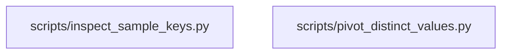

# Reference diagram — astro-events-household-report

Auto-generated by `scripts/reference_diagram/main.py` — do not edit the generated sections by hand; re-run the generator instead after `github_copilot/astro-events-household-report` changes.

Scanned `github_copilot/astro-events-household-report`: 2 Python files (excluding `.venv`, `.git`, `__pycache__`, `.obsidian`, `node_modules`) and detected 0 same-project import edge(s).

## Internal import flowchart

_No same-project imports were detected; files either stand alone or only import stdlib/third-party modules._

## Convergence target

- Both scripts are thin CSV analysis helpers. `scripts/inspect_sample_keys.py` and `scripts/pivot_distinct_values.py` should consume `src/lib/csv_io/` for shared CSV loading/writing once that module
  lands.
- `scripts/pivot_distinct_values.py`'s markdown/table printing should converge on `src/lib/report_render/`; the Astro-specific grouping choices and household-presence questions remain local to the
  future `investigations/astro-events-household/` port.
