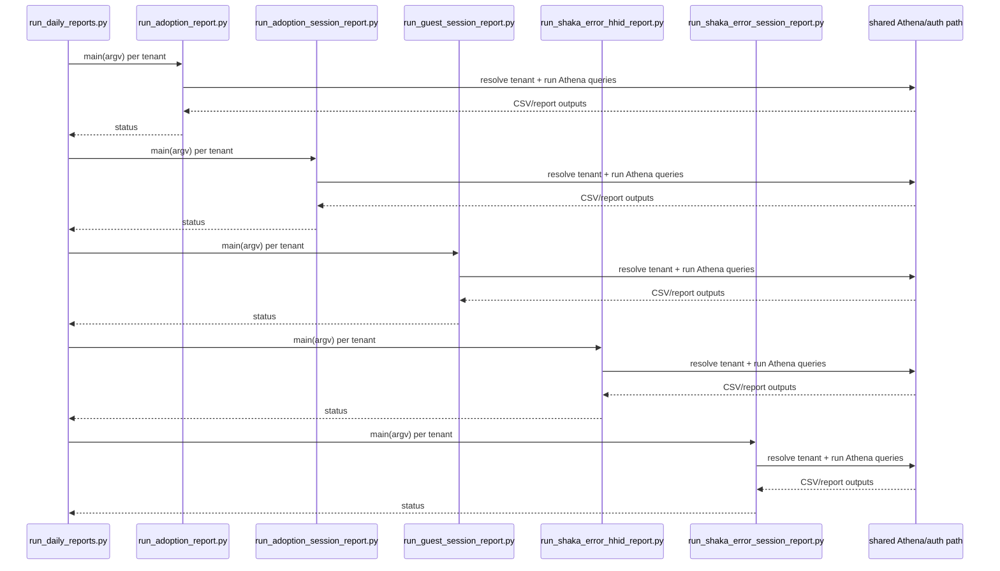

# Reference diagram — aws-access-cli

Auto-generated by `scripts/reference_diagram/main.py` — do not edit the generated sections by hand; re-run the generator instead after `github_copilot/aws-access-cli` changes.

Scanned `github_copilot/aws-access-cli`: 52 production Python file(s) (excluding `.venv`, `.git`, `__pycache__`, `.obsidian`, `node_modules`, and 39 test file(s)) and detected 148 same-project import
edge(s).

## Internal import flowchart

```mermaid
flowchart TD
    scripts_athena_runner_adoption___init___py["scripts/athena_runner/adoption/__init__.py"]
    scripts_athena_runner_adoption_metric_py["scripts/athena_runner/adoption/metric.py"]
    scripts_athena_runner_adoption_metric_runner_py["scripts/athena_runner/adoption/metric_runner.py"]
    scripts_athena_runner_adoption_metrics___init___py["scripts/athena_runner/adoption/metrics/__init__.py"]
    scripts_athena_runner_adoption_metrics_attempts_unique_hhid_py["scripts/athena_runner/adoption/metrics/attempts_unique_hhid.py"]
    scripts_athena_runner_adoption_metrics_ebvs_sessions_py["scripts/athena_runner/adoption/metrics/ebvs_sessions.py"]
    scripts_athena_runner_adoption_metrics_ebvs_unique_hhid_py["scripts/athena_runner/adoption/metrics/ebvs_unique_hhid.py"]
    scripts_athena_runner_adoption_metrics_guest_login_funnel_hhid_py["scripts/athena_runner/adoption/metrics/guest_login_funnel_hhid.py"]
    scripts_athena_runner_adoption_metrics_home_screen_unique_hhid_py["scripts/athena_runner/adoption/metrics/home_screen_unique_hhid.py"]
    scripts_athena_runner_adoption_metrics_successful_vod_playback_hhid_py["scripts/athena_runner/adoption/metrics/successful_vod_playback_hhid.py"]
    scripts_athena_runner_adoption_metrics_successful_vod_playback_sessions_py["scripts/athena_runner/adoption/metrics/successful_vod_playback_sessions.py"]
    scripts_athena_runner_adoption_metrics_unique_guest_session_py["scripts/athena_runner/adoption/metrics/unique_guest_session.py"]
    scripts_athena_runner_adoption_metrics_unique_hh_no_vsf_py["scripts/athena_runner/adoption/metrics/unique_hh_no_vsf.py"]
    scripts_athena_runner_adoption_metrics_vod_playback_attempt_sessions_py["scripts/athena_runner/adoption/metrics/vod_playback_attempt_sessions.py"]
    scripts_athena_runner_adoption_metrics_vsf_sessions_py["scripts/athena_runner/adoption/metrics/vsf_sessions.py"]
    scripts_athena_runner_adoption_metrics_vsf_unique_hhid_py["scripts/athena_runner/adoption/metrics/vsf_unique_hhid.py"]
    scripts_athena_runner_adoption_month_chunks_py["scripts/athena_runner/adoption/month_chunks.py"]
    scripts_athena_runner_adoption_period_report_store_py["scripts/athena_runner/adoption/period_report_store.py"]
    scripts_athena_runner_adoption_registry_py["scripts/athena_runner/adoption/registry.py"]
    scripts_athena_runner_adoption_report_store_py["scripts/athena_runner/adoption/report_store.py"]
    scripts_athena_runner_position_report___init___py["scripts/athena_runner/position_report/__init__.py"]
    scripts_athena_runner_position_report_derive_py["scripts/athena_runner/position_report/derive.py"]
    scripts_athena_runner_queries___init___py["scripts/athena_runner/queries/__init__.py"]
    scripts_athena_runner_queries_base_py["scripts/athena_runner/queries/base.py"]
    scripts_athena_runner_queries_error_1xxx_session_ids_py["scripts/athena_runner/queries/error_1xxx_session_ids.py"]
    scripts_athena_runner_queries_incomplete_no_destroy_session_ids_py["scripts/athena_runner/queries/incomplete_no_destroy_session_ids.py"]
    scripts_athena_runner_queries_params_py["scripts/athena_runner/queries/params.py"]
    scripts_athena_runner_queries_playback_outcome_py["scripts/athena_runner/queries/playback_outcome.py"]
    scripts_athena_runner_queries_registry_py["scripts/athena_runner/queries/registry.py"]
    scripts_athena_runner_queries_session_debug_events_py["scripts/athena_runner/queries/session_debug_events.py"]
    scripts_athena_runner_shaka_errors___init___py["scripts/athena_runner/shaka_errors/__init__.py"]
    scripts_athena_runner_shaka_errors_column_merge_py["scripts/athena_runner/shaka_errors/column_merge.py"]
    scripts_athena_runner_shaka_errors_constants_py["scripts/athena_runner/shaka_errors/constants.py"]
    scripts_athena_runner_shaka_errors_query_py["scripts/athena_runner/shaka_errors/query.py"]
    scripts_athena_runner_shaka_errors_runner_py["scripts/athena_runner/shaka_errors/runner.py"]
    scripts_athena_runner_tenants_py["scripts/athena_runner/tenants.py"]
    scripts_refresh_aws_sso_py["scripts/refresh_aws_sso.py"]
    scripts_run_adoption_gap_analysis_report_py["scripts/run_adoption_gap_analysis_report.py"]
    scripts_run_adoption_gap_analysis_session_report_py["scripts/run_adoption_gap_analysis_session_report.py"]
    scripts_run_adoption_report_py["scripts/run_adoption_report.py"]
    scripts_run_adoption_session_report_py["scripts/run_adoption_session_report.py"]
    scripts_run_athena_query_py["scripts/run_athena_query.py"]
    scripts_run_daily_reports_py["scripts/run_daily_reports.py"]
    scripts_run_guest_session_report_py["scripts/run_guest_session_report.py"]
    scripts_run_historical_backfill_py["scripts/run_historical_backfill.py"]
    scripts_run_historical_period_reports_py["scripts/run_historical_period_reports.py"]
    scripts_run_incomplete_no_destroy_investigation_py["scripts/run_incomplete_no_destroy_investigation.py"]
    scripts_run_monthly_reports_py["scripts/run_monthly_reports.py"]
    scripts_run_shaka_1xxx_position_report_py["scripts/run_shaka_1xxx_position_report.py"]
    scripts_run_shaka_error_hhid_report_py["scripts/run_shaka_error_hhid_report.py"]
    scripts_run_shaka_error_session_report_py["scripts/run_shaka_error_session_report.py"]
    scripts_run_weekly_reports_py["scripts/run_weekly_reports.py"]
    scripts_athena_runner_adoption_metric_runner_py --> scripts_athena_runner_adoption_metric_py
    scripts_athena_runner_adoption_metrics_attempts_unique_hhid_py --> scripts_athena_runner_adoption_metric_py
    scripts_athena_runner_adoption_metrics_attempts_unique_hhid_py --> scripts_athena_runner_tenants_py
    scripts_athena_runner_adoption_metrics_ebvs_sessions_py --> scripts_athena_runner_adoption_metric_py
    scripts_athena_runner_adoption_metrics_ebvs_sessions_py --> scripts_athena_runner_tenants_py
    scripts_athena_runner_adoption_metrics_ebvs_unique_hhid_py --> scripts_athena_runner_adoption_metric_py
    scripts_athena_runner_adoption_metrics_ebvs_unique_hhid_py --> scripts_athena_runner_tenants_py
    scripts_athena_runner_adoption_metrics_guest_login_funnel_hhid_py --> scripts_athena_runner_adoption_metric_py
    scripts_athena_runner_adoption_metrics_guest_login_funnel_hhid_py --> scripts_athena_runner_tenants_py
    scripts_athena_runner_adoption_metrics_home_screen_unique_hhid_py --> scripts_athena_runner_adoption_metric_py
    scripts_athena_runner_adoption_metrics_home_screen_unique_hhid_py --> scripts_athena_runner_tenants_py
    scripts_athena_runner_adoption_metrics_successful_vod_playback_hhid_py --> scripts_athena_runner_adoption_metric_py
    scripts_athena_runner_adoption_metrics_successful_vod_playback_hhid_py --> scripts_athena_runner_tenants_py
    scripts_athena_runner_adoption_metrics_successful_vod_playback_sessions_py --> scripts_athena_runner_adoption_metric_py
    scripts_athena_runner_adoption_metrics_successful_vod_playback_sessions_py --> scripts_athena_runner_tenants_py
    scripts_athena_runner_adoption_metrics_unique_guest_session_py --> scripts_athena_runner_adoption_metric_py
    scripts_athena_runner_adoption_metrics_unique_guest_session_py --> scripts_athena_runner_tenants_py
    scripts_athena_runner_adoption_metrics_unique_hh_no_vsf_py --> scripts_athena_runner_adoption_metric_py
    scripts_athena_runner_adoption_metrics_unique_hh_no_vsf_py --> scripts_athena_runner_tenants_py
    scripts_athena_runner_adoption_metrics_vod_playback_attempt_sessions_py --> scripts_athena_runner_adoption_metric_py
    scripts_athena_runner_adoption_metrics_vod_playback_attempt_sessions_py --> scripts_athena_runner_tenants_py
    scripts_athena_runner_adoption_metrics_vsf_sessions_py --> scripts_athena_runner_adoption_metric_py
    scripts_athena_runner_adoption_metrics_vsf_sessions_py --> scripts_athena_runner_tenants_py
    scripts_athena_runner_adoption_metrics_vsf_unique_hhid_py --> scripts_athena_runner_adoption_metric_py
    scripts_athena_runner_adoption_metrics_vsf_unique_hhid_py --> scripts_athena_runner_tenants_py
    scripts_athena_runner_adoption_month_chunks_py --> scripts_athena_runner_adoption_report_store_py
    scripts_athena_runner_adoption_registry_py --> scripts_athena_runner_adoption_metric_py
    scripts_athena_runner_adoption_registry_py --> scripts_athena_runner_adoption_metrics_attempts_unique_hhid_py
    scripts_athena_runner_adoption_registry_py --> scripts_athena_runner_adoption_metrics_ebvs_sessions_py
    scripts_athena_runner_adoption_registry_py --> scripts_athena_runner_adoption_metrics_ebvs_unique_hhid_py
    scripts_athena_runner_adoption_registry_py --> scripts_athena_runner_adoption_metrics_guest_login_funnel_hhid_py
    scripts_athena_runner_adoption_registry_py --> scripts_athena_runner_adoption_metrics_home_screen_unique_hhid_py
    scripts_athena_runner_adoption_registry_py --> scripts_athena_runner_adoption_metrics_successful_vod_playback_hhid_py
    scripts_athena_runner_adoption_registry_py --> scripts_athena_runner_adoption_metrics_successful_vod_playback_sessions_py
    scripts_athena_runner_adoption_registry_py --> scripts_athena_runner_adoption_metrics_unique_guest_session_py
    scripts_athena_runner_adoption_registry_py --> scripts_athena_runner_adoption_metrics_unique_hh_no_vsf_py
    scripts_athena_runner_adoption_registry_py --> scripts_athena_runner_adoption_metrics_vod_playback_attempt_sessions_py
    scripts_athena_runner_adoption_registry_py --> scripts_athena_runner_adoption_metrics_vsf_sessions_py
    scripts_athena_runner_adoption_registry_py --> scripts_athena_runner_adoption_metrics_vsf_unique_hhid_py
    scripts_athena_runner_adoption_registry_py --> scripts_athena_runner_tenants_py
    scripts_athena_runner_queries_error_1xxx_session_ids_py --> scripts_athena_runner_queries_base_py
    scripts_athena_runner_queries_error_1xxx_session_ids_py --> scripts_athena_runner_queries_params_py
    scripts_athena_runner_queries_error_1xxx_session_ids_py --> scripts_athena_runner_tenants_py
    scripts_athena_runner_queries_incomplete_no_destroy_session_ids_py --> scripts_athena_runner_queries_base_py
    scripts_athena_runner_queries_incomplete_no_destroy_session_ids_py --> scripts_athena_runner_queries_params_py
    scripts_athena_runner_queries_incomplete_no_destroy_session_ids_py --> scripts_athena_runner_tenants_py
    scripts_athena_runner_queries_playback_outcome_py --> scripts_athena_runner_queries_base_py
    scripts_athena_runner_queries_playback_outcome_py --> scripts_athena_runner_queries_params_py
    scripts_athena_runner_queries_playback_outcome_py --> scripts_athena_runner_tenants_py
    scripts_athena_runner_queries_registry_py --> scripts_athena_runner_queries_base_py
    scripts_athena_runner_queries_registry_py --> scripts_athena_runner_queries_error_1xxx_session_ids_py
    scripts_athena_runner_queries_registry_py --> scripts_athena_runner_queries_incomplete_no_destroy_session_ids_py
    scripts_athena_runner_queries_registry_py --> scripts_athena_runner_queries_playback_outcome_py
    scripts_athena_runner_queries_registry_py --> scripts_athena_runner_queries_session_debug_events_py
    scripts_athena_runner_queries_session_debug_events_py --> scripts_athena_runner_queries_base_py
    scripts_athena_runner_queries_session_debug_events_py --> scripts_athena_runner_queries_params_py
    scripts_athena_runner_queries_session_debug_events_py --> scripts_athena_runner_tenants_py
    scripts_athena_runner_shaka_errors_column_merge_py --> scripts_athena_runner_adoption_report_store_py
    scripts_athena_runner_shaka_errors_query_py --> scripts_athena_runner_tenants_py
    scripts_athena_runner_shaka_errors_runner_py --> scripts_athena_runner_shaka_errors_query_py
    scripts_run_adoption_gap_analysis_report_py --> scripts_athena_runner_adoption_metric_py
    scripts_run_adoption_gap_analysis_report_py --> scripts_athena_runner_adoption_metric_runner_py
    scripts_run_adoption_gap_analysis_report_py --> scripts_athena_runner_adoption_metrics_attempts_unique_hhid_py
    scripts_run_adoption_gap_analysis_report_py --> scripts_athena_runner_adoption_metrics_ebvs_unique_hhid_py
    scripts_run_adoption_gap_analysis_report_py --> scripts_athena_runner_adoption_metrics_successful_vod_playback_hhid_py
    scripts_run_adoption_gap_analysis_report_py --> scripts_athena_runner_adoption_metrics_vsf_unique_hhid_py
    scripts_run_adoption_gap_analysis_report_py --> scripts_athena_runner_tenants_py
    scripts_run_adoption_gap_analysis_session_report_py --> scripts_athena_runner_adoption_metric_py
    scripts_run_adoption_gap_analysis_session_report_py --> scripts_athena_runner_adoption_metric_runner_py
    scripts_run_adoption_gap_analysis_session_report_py --> scripts_athena_runner_adoption_metrics_ebvs_sessions_py
    scripts_run_adoption_gap_analysis_session_report_py --> scripts_athena_runner_adoption_metrics_successful_vod_playback_sessions_py
    scripts_run_adoption_gap_analysis_session_report_py --> scripts_athena_runner_adoption_metrics_vod_playback_attempt_sessions_py
    scripts_run_adoption_gap_analysis_session_report_py --> scripts_athena_runner_adoption_metrics_vsf_sessions_py
    scripts_run_adoption_gap_analysis_session_report_py --> scripts_athena_runner_tenants_py
    scripts_run_adoption_report_py --> scripts_athena_runner_adoption_metric_runner_py
    scripts_run_adoption_report_py --> scripts_athena_runner_adoption_month_chunks_py
    scripts_run_adoption_report_py --> scripts_athena_runner_adoption_period_report_store_py
    scripts_run_adoption_report_py --> scripts_athena_runner_adoption_registry_py
    scripts_run_adoption_report_py --> scripts_athena_runner_adoption_report_store_py
    scripts_run_adoption_report_py --> scripts_athena_runner_tenants_py
    scripts_run_adoption_session_report_py --> scripts_athena_runner_adoption_metric_runner_py
    scripts_run_adoption_session_report_py --> scripts_athena_runner_adoption_month_chunks_py
    scripts_run_adoption_session_report_py --> scripts_athena_runner_adoption_period_report_store_py
    scripts_run_adoption_session_report_py --> scripts_athena_runner_adoption_registry_py
    scripts_run_adoption_session_report_py --> scripts_athena_runner_adoption_report_store_py
    scripts_run_adoption_session_report_py --> scripts_athena_runner_tenants_py
    scripts_run_athena_query_py --> scripts_athena_runner_queries_registry_py
    scripts_run_daily_reports_py --> scripts_athena_runner_tenants_py
    scripts_run_daily_reports_py --> scripts_run_adoption_report_py
    scripts_run_daily_reports_py --> scripts_run_adoption_session_report_py
    scripts_run_daily_reports_py --> scripts_run_guest_session_report_py
    scripts_run_daily_reports_py --> scripts_run_shaka_1xxx_position_report_py
    scripts_run_daily_reports_py --> scripts_run_shaka_error_hhid_report_py
    scripts_run_daily_reports_py --> scripts_run_shaka_error_session_report_py
    scripts_run_guest_session_report_py --> scripts_athena_runner_adoption_metric_runner_py
    scripts_run_guest_session_report_py --> scripts_athena_runner_adoption_month_chunks_py
    scripts_run_guest_session_report_py --> scripts_athena_runner_adoption_period_report_store_py
    scripts_run_guest_session_report_py --> scripts_athena_runner_adoption_registry_py
    scripts_run_guest_session_report_py --> scripts_athena_runner_adoption_report_store_py
    scripts_run_guest_session_report_py --> scripts_athena_runner_tenants_py
    scripts_run_historical_backfill_py --> scripts_athena_runner_tenants_py
    scripts_run_historical_backfill_py --> scripts_run_adoption_report_py
    scripts_run_historical_backfill_py --> scripts_run_adoption_session_report_py
    scripts_run_historical_backfill_py --> scripts_run_guest_session_report_py
    scripts_run_historical_backfill_py --> scripts_run_shaka_error_hhid_report_py
    scripts_run_historical_backfill_py --> scripts_run_shaka_error_session_report_py
    scripts_run_historical_period_reports_py --> scripts_athena_runner_tenants_py
    scripts_run_historical_period_reports_py --> scripts_run_adoption_report_py
    scripts_run_historical_period_reports_py --> scripts_run_adoption_session_report_py
    scripts_run_historical_period_reports_py --> scripts_run_guest_session_report_py
    scripts_run_historical_period_reports_py --> scripts_run_shaka_error_hhid_report_py
    scripts_run_historical_period_reports_py --> scripts_run_shaka_error_session_report_py
    scripts_run_incomplete_no_destroy_investigation_py --> scripts_athena_runner_queries_base_py
    scripts_run_incomplete_no_destroy_investigation_py --> scripts_athena_runner_queries_incomplete_no_destroy_session_ids_py
    scripts_run_incomplete_no_destroy_investigation_py --> scripts_athena_runner_queries_session_debug_events_py
    scripts_run_incomplete_no_destroy_investigation_py --> scripts_athena_runner_tenants_py
    scripts_run_monthly_reports_py --> scripts_athena_runner_tenants_py
    scripts_run_monthly_reports_py --> scripts_run_adoption_report_py
    scripts_run_monthly_reports_py --> scripts_run_adoption_session_report_py
    scripts_run_monthly_reports_py --> scripts_run_guest_session_report_py
    scripts_run_monthly_reports_py --> scripts_run_shaka_error_hhid_report_py
    scripts_run_monthly_reports_py --> scripts_run_shaka_error_session_report_py
    scripts_run_shaka_1xxx_position_report_py --> scripts_athena_runner_position_report_derive_py
    scripts_run_shaka_1xxx_position_report_py --> scripts_athena_runner_queries_base_py
    scripts_run_shaka_1xxx_position_report_py --> scripts_athena_runner_queries_error_1xxx_session_ids_py
    scripts_run_shaka_1xxx_position_report_py --> scripts_athena_runner_queries_playback_outcome_py
    scripts_run_shaka_1xxx_position_report_py --> scripts_athena_runner_queries_session_debug_events_py
    scripts_run_shaka_1xxx_position_report_py --> scripts_athena_runner_tenants_py
    scripts_run_shaka_error_hhid_report_py --> scripts_athena_runner_adoption_period_report_store_py
    scripts_run_shaka_error_hhid_report_py --> scripts_athena_runner_adoption_report_store_py
    scripts_run_shaka_error_hhid_report_py --> scripts_athena_runner_shaka_errors_column_merge_py
    scripts_run_shaka_error_hhid_report_py --> scripts_athena_runner_shaka_errors_constants_py
    scripts_run_shaka_error_hhid_report_py --> scripts_athena_runner_shaka_errors_query_py
    scripts_run_shaka_error_hhid_report_py --> scripts_athena_runner_shaka_errors_runner_py
    scripts_run_shaka_error_hhid_report_py --> scripts_athena_runner_tenants_py
    scripts_run_shaka_error_session_report_py --> scripts_athena_runner_adoption_period_report_store_py
    scripts_run_shaka_error_session_report_py --> scripts_athena_runner_adoption_report_store_py
    scripts_run_shaka_error_session_report_py --> scripts_athena_runner_shaka_errors_column_merge_py
    scripts_run_shaka_error_session_report_py --> scripts_athena_runner_shaka_errors_constants_py
    scripts_run_shaka_error_session_report_py --> scripts_athena_runner_shaka_errors_query_py
    scripts_run_shaka_error_session_report_py --> scripts_athena_runner_shaka_errors_runner_py
    scripts_run_shaka_error_session_report_py --> scripts_athena_runner_tenants_py
    scripts_run_weekly_reports_py --> scripts_athena_runner_tenants_py
    scripts_run_weekly_reports_py --> scripts_run_adoption_report_py
    scripts_run_weekly_reports_py --> scripts_run_adoption_session_report_py
    scripts_run_weekly_reports_py --> scripts_run_guest_session_report_py
    scripts_run_weekly_reports_py --> scripts_run_shaka_error_hhid_report_py
    scripts_run_weekly_reports_py --> scripts_run_shaka_error_session_report_py
```

## `run_daily_reports.py` fan-out



## Convergence target

This diagram supports `pipeline-migration`'s `aws-access-cli-pipeline-migration` sub-story; it does not replace that story's actual porting work. The migrated target remains a real pipeline under
`src/pipelines/aws-access-cli/`, reusing shared `src/lib/*` Athena/auth/CSV/report code rather than this project's private copies.
