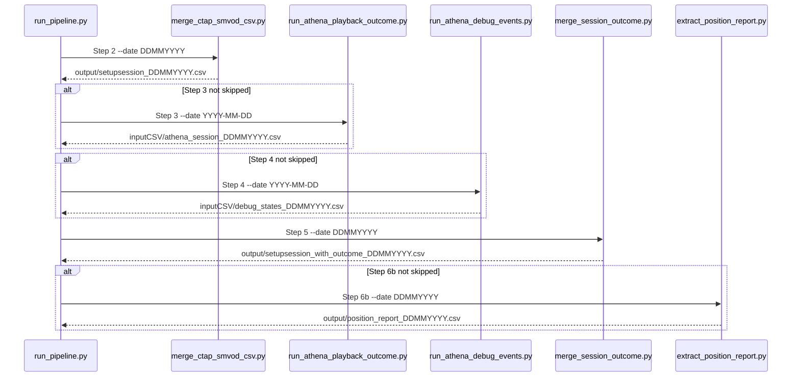
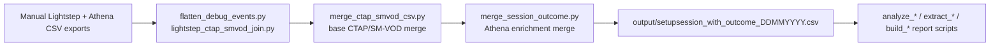

# Reference diagram — ctap-smvod-session-report

This project's migration value is its orchestration and report data flow, not an internal import graph.

## `run_pipeline.py` orchestration (BLUEPRINT steps 2–6b)

## Report data flow

## Convergence target

This diagram supports `pipeline-migration`'s `ctap-smvod-investigation-migration` sub-story; it does not replace that story's actual migration work. The migrated target remains an investigation
pipeline under `investigations/ctap-smvod/`, reusing shared Athena/CSV/report helpers while preserving the export-driven orchestration shown here.
