# Reference diagram — mtn-network-traffic

Auto-generated by `scripts/reference_diagram/main.py` — do not edit the generated sections by hand; re-run the generator instead after `github_copilot/mtn-network-traffic` changes.

Scanned `github_copilot/mtn-network-traffic`: 14 production Python file(s) (excluding `.venv`, `.git`, `__pycache__`, `.obsidian`, `node_modules`, and 8 test file(s)) and detected 12 same-project
import edge(s).

## Internal import flowchart

```mermaid
flowchart TD
    scripts_curl_timer___init___py["scripts/curl_timer/__init__.py"]
    scripts_curl_timer_blocks_py["scripts/curl_timer/blocks.py"]
    scripts_curl_timer_curl_timing_py["scripts/curl_timer/curl_timing.py"]
    scripts_curl_timer_dns_trace_py["scripts/curl_timer/dns_trace.py"]
    scripts_curl_timer_jwt_inspect_py["scripts/curl_timer/jwt_inspect.py"]
    scripts_curl_timer_markdown_report_py["scripts/curl_timer/markdown_report.py"]
    scripts_curl_timer_mtr_probe_py["scripts/curl_timer/mtr_probe.py"]
    scripts_curl_timer_report_py["scripts/curl_timer/report.py"]
    scripts_curl_timer_tls_probe_py["scripts/curl_timer/tls_probe.py"]
    scripts_curl_timer_traceroute_py["scripts/curl_timer/traceroute.py"]
    scripts_curl_timer_whois_lookup_py["scripts/curl_timer/whois_lookup.py"]
    scripts_generate_timing_report_py["scripts/generate_timing_report.py"]
    scripts_inspect_curl_auth_py["scripts/inspect_curl_auth.py"]
    scripts_time_curl_requests_py["scripts/time_curl_requests.py"]
    scripts_curl_timer_report_py --> scripts_curl_timer_curl_timing_py
    scripts_curl_timer_traceroute_py --> scripts_curl_timer_whois_lookup_py
    scripts_generate_timing_report_py --> scripts_curl_timer_markdown_report_py
    scripts_inspect_curl_auth_py --> scripts_curl_timer_blocks_py
    scripts_inspect_curl_auth_py --> scripts_curl_timer_jwt_inspect_py
    scripts_time_curl_requests_py --> scripts_curl_timer_blocks_py
    scripts_time_curl_requests_py --> scripts_curl_timer_curl_timing_py
    scripts_time_curl_requests_py --> scripts_curl_timer_dns_trace_py
    scripts_time_curl_requests_py --> scripts_curl_timer_mtr_probe_py
    scripts_time_curl_requests_py --> scripts_curl_timer_report_py
    scripts_time_curl_requests_py --> scripts_curl_timer_tls_probe_py
    scripts_time_curl_requests_py --> scripts_curl_timer_traceroute_py
```

## Convergence target

Per GAP-1, this project's curl timing, DNS trace, TLS probe, traceroute, `mtr`, and whois stack stays local rather than promoting a new shared module. Its target is `src/tools/mtn-network-traffic/`,
where it can optionally consume existing shared helpers such as `src/lib/curl_to_python/` for curl parsing and `src/lib/report_render/` for markdown/table output, while the diagnostics logic itself
remains single-consumer tooling.
