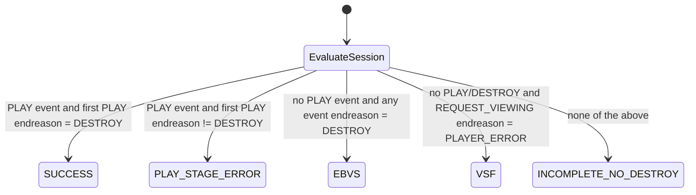

# Reference diagram — mtn-zm-session-device-investigation

Auto-generated by `scripts/reference_diagram/main.py` — do not edit the generated sections by hand; re-run the generator instead after `github_copilot/mtn-zm-session-device-investigation` changes.

Scanned `github_copilot/mtn-zm-session-device-investigation`: 32 Python files (excluding `.venv`, `.git`, `__pycache__`, `.obsidian`, `node_modules`) and detected 48 same-project import edge(s).

## Internal import flowchart

```mermaid
flowchart TD
    scripts_athena_runner_investigation_config_py["scripts/athena_runner/investigation_config.py"]
    scripts_athena_runner_queries___init___py["scripts/athena_runner/queries/__init__.py"]
    scripts_athena_runner_queries_base_py["scripts/athena_runner/queries/base.py"]
    scripts_athena_runner_queries_debug_events_by_session_ids_py["scripts/athena_runner/queries/debug_events_by_session_ids.py"]
    scripts_athena_runner_queries_debug_events_lookup_py["scripts/athena_runner/queries/debug_events_lookup.py"]
    scripts_athena_runner_queries_params_py["scripts/athena_runner/queries/params.py"]
    scripts_athena_runner_queries_registry_py["scripts/athena_runner/queries/registry.py"]
    scripts_athena_runner_queries_unified_sessions_lookup_py["scripts/athena_runner/queries/unified_sessions_lookup.py"]
    scripts_athena_runner_tenants_py["scripts/athena_runner/tenants.py"]
    scripts_athena_runner_time_window_utils_py["scripts/athena_runner/time_window_utils.py"]
    scripts_build_final_session_report_py["scripts/build_final_session_report.py"]
    scripts_classify_session_outcomes_py["scripts/classify_session_outcomes.py"]
    scripts_extract_error_codes_from_debug_events_py["scripts/extract_error_codes_from_debug_events.py"]
    scripts_extract_problematic_session_ids_py["scripts/extract_problematic_session_ids.py"]
    scripts_generate_summary_py["scripts/generate_summary.py"]
    scripts_run_athena_query_py["scripts/run_athena_query.py"]
    scripts_run_investigation_pipeline_py["scripts/run_investigation_pipeline.py"]
    scripts_summarize_final_session_report_py["scripts/summarize_final_session_report.py"]
    scripts_verify_incomplete_no_destroy_py["scripts/verify_incomplete_no_destroy.py"]
    tests_test_build_final_session_report_py["tests/test_build_final_session_report.py"]
    tests_test_classify_session_outcomes_py["tests/test_classify_session_outcomes.py"]
    tests_test_extract_error_codes_from_debug_events_py["tests/test_extract_error_codes_from_debug_events.py"]
    tests_test_extract_problematic_session_ids_py["tests/test_extract_problematic_session_ids.py"]
    tests_test_generate_summary_py["tests/test_generate_summary.py"]
    tests_test_investigation_config_py["tests/test_investigation_config.py"]
    tests_test_queries_py["tests/test_queries.py"]
    tests_test_run_athena_query_py["tests/test_run_athena_query.py"]
    tests_test_run_investigation_pipeline_py["tests/test_run_investigation_pipeline.py"]
    tests_test_summarize_final_session_report_py["tests/test_summarize_final_session_report.py"]
    tests_test_tenants_py["tests/test_tenants.py"]
    tests_test_time_window_utils_py["tests/test_time_window_utils.py"]
    tests_test_verify_incomplete_no_destroy_py["tests/test_verify_incomplete_no_destroy.py"]
    scripts_athena_runner_investigation_config_py --> scripts_athena_runner_tenants_py
    scripts_athena_runner_queries_debug_events_by_session_ids_py --> scripts_athena_runner_investigation_config_py
    scripts_athena_runner_queries_debug_events_by_session_ids_py --> scripts_athena_runner_queries_base_py
    scripts_athena_runner_queries_debug_events_by_session_ids_py --> scripts_athena_runner_queries_params_py
    scripts_athena_runner_queries_debug_events_lookup_py --> scripts_athena_runner_investigation_config_py
    scripts_athena_runner_queries_debug_events_lookup_py --> scripts_athena_runner_queries_base_py
    scripts_athena_runner_queries_debug_events_lookup_py --> scripts_athena_runner_queries_params_py
    scripts_athena_runner_queries_registry_py --> scripts_athena_runner_investigation_config_py
    scripts_athena_runner_queries_registry_py --> scripts_athena_runner_queries_base_py
    scripts_athena_runner_queries_registry_py --> scripts_athena_runner_queries_debug_events_by_session_ids_py
    scripts_athena_runner_queries_registry_py --> scripts_athena_runner_queries_debug_events_lookup_py
    scripts_athena_runner_queries_registry_py --> scripts_athena_runner_queries_unified_sessions_lookup_py
    scripts_athena_runner_queries_unified_sessions_lookup_py --> scripts_athena_runner_investigation_config_py
    scripts_athena_runner_queries_unified_sessions_lookup_py --> scripts_athena_runner_queries_base_py
    scripts_athena_runner_queries_unified_sessions_lookup_py --> scripts_athena_runner_queries_params_py
    scripts_athena_runner_queries_unified_sessions_lookup_py --> scripts_athena_runner_time_window_utils_py
    scripts_run_athena_query_py --> scripts_athena_runner_investigation_config_py
    scripts_run_athena_query_py --> scripts_athena_runner_queries_registry_py
    scripts_run_investigation_pipeline_py --> scripts_athena_runner_investigation_config_py
    scripts_run_investigation_pipeline_py --> scripts_athena_runner_queries_registry_py
    scripts_run_investigation_pipeline_py --> scripts_build_final_session_report_py
    scripts_run_investigation_pipeline_py --> scripts_classify_session_outcomes_py
    scripts_run_investigation_pipeline_py --> scripts_extract_error_codes_from_debug_events_py
    scripts_run_investigation_pipeline_py --> scripts_extract_problematic_session_ids_py
    scripts_run_investigation_pipeline_py --> scripts_run_athena_query_py
    scripts_run_investigation_pipeline_py --> scripts_verify_incomplete_no_destroy_py
    tests_test_build_final_session_report_py --> scripts_build_final_session_report_py
    tests_test_classify_session_outcomes_py --> scripts_classify_session_outcomes_py
    tests_test_extract_error_codes_from_debug_events_py --> scripts_extract_error_codes_from_debug_events_py
    tests_test_extract_problematic_session_ids_py --> scripts_extract_problematic_session_ids_py
    tests_test_investigation_config_py --> scripts_athena_runner_investigation_config_py
    tests_test_investigation_config_py --> scripts_athena_runner_tenants_py
    tests_test_queries_py --> scripts_athena_runner_investigation_config_py
    tests_test_queries_py --> scripts_athena_runner_queries_debug_events_by_session_ids_py
    tests_test_queries_py --> scripts_athena_runner_queries_debug_events_lookup_py
    tests_test_queries_py --> scripts_athena_runner_queries_unified_sessions_lookup_py
    tests_test_queries_py --> scripts_athena_runner_tenants_py
    tests_test_run_athena_query_py --> scripts_athena_runner_investigation_config_py
    tests_test_run_athena_query_py --> scripts_athena_runner_tenants_py
    tests_test_run_athena_query_py --> scripts_run_athena_query_py
    tests_test_run_investigation_pipeline_py --> scripts_athena_runner_investigation_config_py
    tests_test_run_investigation_pipeline_py --> scripts_athena_runner_tenants_py
    tests_test_run_investigation_pipeline_py --> scripts_run_athena_query_py
    tests_test_run_investigation_pipeline_py --> scripts_run_investigation_pipeline_py
    tests_test_summarize_final_session_report_py --> scripts_summarize_final_session_report_py
    tests_test_tenants_py --> scripts_athena_runner_tenants_py
    tests_test_time_window_utils_py --> scripts_athena_runner_time_window_utils_py
    tests_test_verify_incomplete_no_destroy_py --> scripts_verify_incomplete_no_destroy_py
```

## Session outcome state diagram

## Convergence target

Per GAP-1, this is a Tier-2 investigation with no new shared-module promotion. Its target is `investigations/mtn-zm-device/`: `run_athena_query.py` and the query registry consume `src/lib/athena/`,
the CSV joins/report files consume `src/lib/csv_io/` and `src/lib/report_render/`, and the output-path/config handling consumes `src/lib/paths/`; the session-outcome classification logic remains
investigation-specific.
