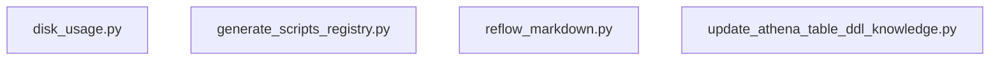

# Reference diagram — scripts

Auto-generated by `scripts/reference_diagram/main.py` — do not edit the generated sections by hand; re-run the generator instead after `github_copilot/scripts` changes.

Scanned `github_copilot/scripts`: 4 Python files (excluding `.venv`, `.git`, `__pycache__`, `.obsidian`, `node_modules`) and detected 0 same-project import edge(s).

## Internal import flowchart

_No same-project imports were detected; files either stand alone or only import stdlib/third-party modules._

## Convergence target

- `disk_usage.py` and `reflow_markdown.py` remain repo-maintenance utilities in the future `src/tools/repo-maintenance/` target; they do not justify new shared `src/lib/*` modules.
- `generate_scripts_registry.py` overlaps the cross-project registry capability already implemented by `functional-code-taxonomy` task FCT-6, so `root-scripts-tool-migration` should check whether the
  repo-native registry already supersedes it instead of porting a second copy.
- `update_athena_table_ddl_knowledge.py` should reuse `src/lib/csv_io/` for CSV reading and `src/lib/report_render/` for reusable markdown-rendering helpers if those abstractions prove general enough;
  its DDL-section replacement workflow stays local to the repo-maintenance tool.
