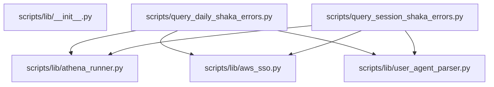

# Reference diagram — shaka-6001-sa-error-analysis

Auto-generated by `scripts/reference_diagram/main.py` — do not edit the generated sections by hand; re-run the generator instead after `github_copilot/shaka-6001-sa-error-analysis` changes.

Scanned `github_copilot/shaka-6001-sa-error-analysis`: 6 Python files (excluding `.venv`, `.git`, `__pycache__`, `.obsidian`, `node_modules`) and detected 6 same-project import edge(s).

## Internal import flowchart

## Convergence target

- `scripts/lib/athena_runner.py` and the live-query portions of `scripts/query_daily_shaka_errors.py` / `scripts/query_session_shaka_errors.py` should converge on `src/lib/athena/`.
- `scripts/lib/aws_sso.py` should be replaced by `src/lib/auth/` once the shared SSO/bootstrap path exists.
- The CSV reading plus printable-session summary output in the two query scripts should consume `src/lib/csv_io/` and, where the text formatting becomes reusable, `src/lib/report_render/`.
- `scripts/lib/user_agent_parser.py` stays local: GAP-1 explicitly kept device/user-agent identity as project-specific logic for the future `investigations/shaka-6001-sa/` target rather than promoting
  a new shared module.
