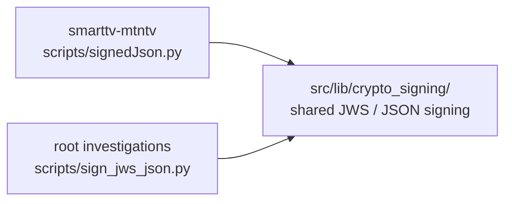

# Reference diagram — smarttv-mtntv

This folder has one relevant script, so the useful view is its shared JWS/JSON-signing duplication rather than an internal import graph.

## `crypto_signing` convergence

## Convergence target

- Per GAP-1, this tool targets `src/tools/smarttv-mtntv/`.
- Its blocker is the promoted `src/lib/crypto_signing/` module: both scripts implement the same HS256 JWS base64url-signing mechanism, differing mainly in payload casing and wrapper/output
  conventions.
- Once `src/lib/crypto_signing/` lands, `signedJson.py` should become a thin tool-specific wrapper around the shared signer instead of carrying a second copy of the signing code.
