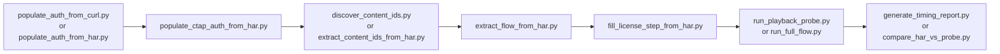
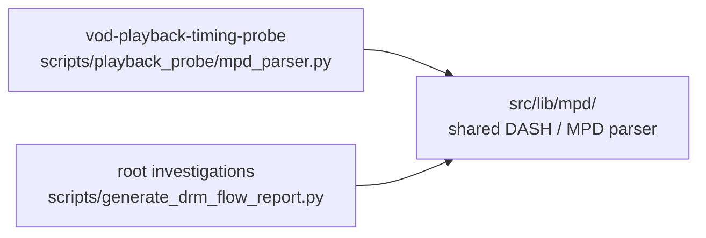

# Reference diagram — vod-playback-timing-probe

This folder's migration value is its end-to-end playback probe chain and its duplicated DASH/MPD parsing logic, not a raw internal-import graph.

## CLI chain

## DASH/MPD convergence

## Convergence target

- Per GAP-1, this project targets `src/tools/vod-playback-timing-probe/`.
- Its playback-session correlation, flow-template extraction, and live probe orchestration stay local to that tool.
- Its DASH/manifest parsing does **not** stay local: `playback_probe/mpd_parser.py` and root `investigations/scripts/generate_drm_flow_report.py` are the two real consumers that justify the promoted
  `src/lib/mpd/` module.
- That shared `mpd` module is the Tier-3 blocker for `vod-playback-timing-probe-tool-migration`; this diagram exists to make that dependency visible before the actual port starts.
